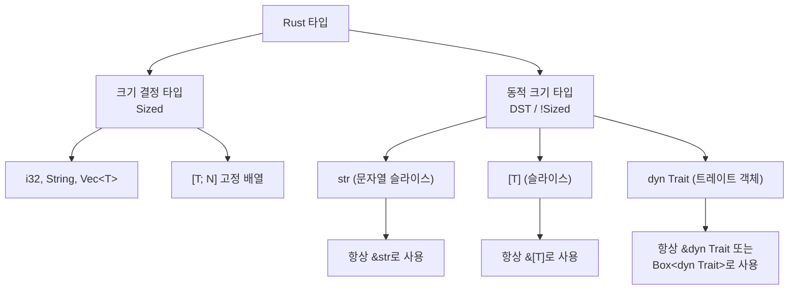

# DST와 변환

## 21.4 동적 크기 타입 (DST)과 Sized 트레이트

대부분의 Rust 타입은 컴파일 타임에 크기가 결정됩니다. 그러나 `str`, `[T]`, `dyn Trait`은 런타임에만 크기를 알 수 있는 동적 크기 타입(DST)입니다.



```rust,editable
use std::fmt;

// 기본적으로 모든 제네릭 매개변수는 T: Sized
// ?Sized를 붙이면 DST도 허용
fn print_ref<T: fmt::Display + ?Sized>(val: &T) {
    println!("값: {}", val);
}

// Sized 바운드가 있으면 DST 불가
fn print_sized<T: fmt::Display>(val: T) {
    println!("값: {}", val);
}

fn main() {
    let s: String = "안녕하세요".to_string();

    // &String -> &str로 Deref 강제 변환
    print_ref(&s);          // String 참조
    print_ref("리터럴");     // &str (DST의 참조)

    // print_sized는 Sized 타입만 허용
    print_sized(s);          // String (Sized) - OK
    // print_sized(*"hello"); // str (DST) - 컴파일 에러!
}
```

<div class="warning-box">
<strong>⚠️ DST 사용 규칙</strong><br>
DST는 직접 값으로 사용할 수 없습니다. 반드시 참조(<code>&str</code>, <code>&[T]</code>) 또는 스마트 포인터(<code>Box&lt;dyn Trait&gt;</code>, <code>Rc&lt;dyn Trait&gt;</code>)를 통해 간접적으로 사용해야 합니다.
</div>

---

## 21.5 Deref 강제 변환, AsRef vs Borrow

### Deref 강제 변환

Rust는 `Deref` 트레이트를 통해 자동으로 타입을 변환합니다.

```rust,editable
use std::ops::Deref;

struct MyString {
    data: String,
}

impl Deref for MyString {
    type Target = str;

    fn deref(&self) -> &str {
        &self.data
    }
}

// &str을 받는 함수
fn greet(name: &str) {
    println!("안녕하세요, {}!", name);
}

fn main() {
    let my_str = MyString {
        data: "세계".to_string(),
    };

    // Deref 강제 변환 체인:
    // &MyString -> &str (Deref)
    greet(&my_str);

    // String도 마찬가지:
    // &String -> &str (Deref)
    let s = String::from("Rust");
    greet(&s);

    // Box도:
    // &Box<String> -> &String -> &str
    let boxed = Box::new(String::from("Box"));
    greet(&boxed);
}
```

### AsRef vs Borrow

```rust,editable
use std::borrow::Borrow;

// AsRef: 참조 변환 (가벼운 변환)
fn print_path<P: AsRef<std::path::Path>>(path: P) {
    println!("경로: {:?}", path.as_ref());
}

// Borrow: Eq, Hash, Ord가 일관된 참조 변환
// HashMap의 키 조회에 유용
fn find_in_map<Q>(map: &std::collections::HashMap<String, i32>, key: &Q) -> Option<&i32>
where
    String: Borrow<Q>,
    Q: std::hash::Hash + Eq + ?Sized,
{
    map.get(key)
}

fn main() {
    // AsRef: 다양한 타입을 경로로 변환
    print_path("/home/user");          // &str -> Path
    print_path(String::from("/tmp"));   // String -> Path

    // Borrow: HashMap 키 조회
    let mut map = std::collections::HashMap::new();
    map.insert("hello".to_string(), 42);

    // String 키를 &str로 검색 가능
    if let Some(val) = find_in_map(&map, "hello") {
        println!("값: {}", val);
    }
}
```

<div class="tip-box">
<strong>💡 AsRef vs Borrow 선택 기준</strong><br>
<ul>
<li><strong>AsRef</strong>: 단순한 참조 변환이 필요할 때 (파일 경로, 문자열 등)</li>
<li><strong>Borrow</strong>: Hash, Eq, Ord의 일관성이 필요할 때 (HashMap 키 검색 등)</li>
</ul>
</div>
