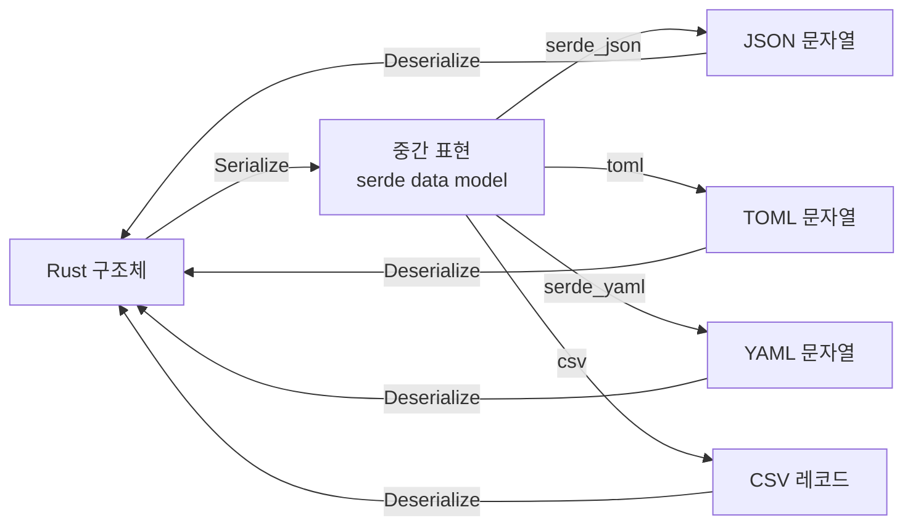
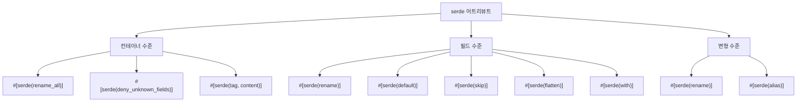

# 직렬화와 역직렬화 <span class="badge-advanced">고급</span>

Rust에서 데이터를 JSON, TOML, YAML, CSV 등 다양한 형식으로 변환하려면 **serde** 생태계를 사용합니다. serde는 "**Ser**ialize / **De**serialize"의 약자로, Rust에서 가장 널리 사용되는 직렬화 프레임워크입니다.

---

## 22.1 serde 기본: Serialize와 Deserialize



### Cargo.toml 설정

```toml
[dependencies]
serde = { version = "1", features = ["derive"] }
serde_json = "1"
toml = "0.8"
serde_yaml = "0.9"
csv = "1"
```

### 기본 사용법

```rust,editable
use serde::{Serialize, Deserialize};

#[derive(Debug, Serialize, Deserialize)]
struct User {
    name: String,
    age: u32,
    email: String,
    is_active: bool,
}

fn main() {
    // Rust 구조체 -> JSON (직렬화)
    let user = User {
        name: "김철수".to_string(),
        age: 28,
        email: "chulsoo@example.com".to_string(),
        is_active: true,
    };

    let json = serde_json::to_string(&user).unwrap();
    println!("JSON: {}", json);

    // 보기 좋은 JSON
    let pretty_json = serde_json::to_string_pretty(&user).unwrap();
    println!("Pretty JSON:\n{}", pretty_json);

    // JSON -> Rust 구조체 (역직렬화)
    let json_str = r#"
    {
        "name": "이영희",
        "age": 25,
        "email": "younghee@example.com",
        "is_active": false
    }"#;

    let parsed: User = serde_json::from_str(json_str).unwrap();
    println!("파싱된 사용자: {:?}", parsed);
}
```

---

## 22.2 serde_json 심화

### 동적 JSON 처리: serde_json::Value

구조를 미리 알 수 없는 JSON을 처리할 때 `Value` 타입을 사용합니다.

```rust,editable
use serde_json::{json, Value};

fn main() {
    // json! 매크로로 동적 JSON 생성
    let data = json!({
        "name": "API 응답",
        "status": 200,
        "data": {
            "items": ["사과", "바나나", "체리"],
            "total": 3
        },
        "metadata": null
    });

    // 인덱싱으로 접근
    println!("상태: {}", data["status"]);
    println!("첫 번째 항목: {}", data["data"]["items"][0]);

    // 안전한 접근
    if let Some(total) = data["data"]["total"].as_u64() {
        println!("총 개수: {}", total);
    }

    // Value를 구조체로 변환
    #[derive(serde::Deserialize, Debug)]
    struct ApiResponse {
        name: String,
        status: u32,
    }

    let response: ApiResponse = serde_json::from_value(data.clone()).unwrap();
    println!("응답: {:?}", response);
}
```

### 열거형 직렬화

```rust,editable
use serde::{Serialize, Deserialize};

// 기본 열거형 직렬화 (외부 태깅)
#[derive(Debug, Serialize, Deserialize)]
enum Shape {
    Circle { radius: f64 },
    Rectangle { width: f64, height: f64 },
    Triangle { base: f64, height: f64 },
}

// 내부 태깅
#[derive(Debug, Serialize, Deserialize)]
#[serde(tag = "type")]
enum Event {
    #[serde(rename = "click")]
    Click { x: i32, y: i32 },
    #[serde(rename = "keypress")]
    KeyPress { key: String },
    #[serde(rename = "scroll")]
    Scroll { delta: f64 },
}

// 인접 태깅
#[derive(Debug, Serialize, Deserialize)]
#[serde(tag = "t", content = "c")]
enum Message {
    Text(String),
    Image { url: String, width: u32 },
}

fn main() {
    // 외부 태깅
    let shape = Shape::Circle { radius: 5.0 };
    let json = serde_json::to_string_pretty(&shape).unwrap();
    println!("외부 태깅:\n{}\n", json);

    // 내부 태깅
    let event = Event::Click { x: 100, y: 200 };
    let json = serde_json::to_string_pretty(&event).unwrap();
    println!("내부 태깅:\n{}\n", json);

    // 인접 태깅
    let msg = Message::Text("안녕하세요".to_string());
    let json = serde_json::to_string_pretty(&msg).unwrap();
    println!("인접 태깅:\n{}\n", json);

    // 역직렬화
    let event_json = r#"{"type": "keypress", "key": "Enter"}"#;
    let event: Event = serde_json::from_str(event_json).unwrap();
    println!("역직렬화: {:?}", event);
}
```

---

## 22.3 TOML, YAML, CSV

### TOML (설정 파일)

```rust,editable
use serde::{Serialize, Deserialize};

#[derive(Debug, Serialize, Deserialize)]
struct Config {
    title: String,
    database: DatabaseConfig,
    server: ServerConfig,
}

#[derive(Debug, Serialize, Deserialize)]
struct DatabaseConfig {
    host: String,
    port: u16,
    name: String,
    max_connections: u32,
}

#[derive(Debug, Serialize, Deserialize)]
struct ServerConfig {
    host: String,
    port: u16,
    workers: usize,
}

fn main() {
    let toml_str = r#"
        title = "나의 프로젝트"

        [database]
        host = "localhost"
        port = 5432
        name = "mydb"
        max_connections = 10

        [server]
        host = "0.0.0.0"
        port = 8080
        workers = 4
    "#;

    // TOML -> Rust 구조체
    let config: Config = toml::from_str(toml_str).unwrap();
    println!("설정: {:#?}", config);

    // Rust 구조체 -> TOML
    let output = toml::to_string_pretty(&config).unwrap();
    println!("TOML 출력:\n{}", output);
}
```

### YAML

```rust,editable
use serde::{Serialize, Deserialize};

#[derive(Debug, Serialize, Deserialize)]
struct DockerCompose {
    version: String,
    services: std::collections::HashMap<String, Service>,
}

#[derive(Debug, Serialize, Deserialize)]
struct Service {
    image: String,
    ports: Vec<String>,
    #[serde(default)]
    environment: Vec<String>,
}

fn main() {
    let yaml_str = r#"
version: "3.8"
services:
  web:
    image: nginx:latest
    ports:
      - "80:80"
      - "443:443"
    environment:
      - NGINX_HOST=example.com
  db:
    image: postgres:15
    ports:
      - "5432:5432"
    environment:
      - POSTGRES_PASSWORD=secret
"#;

    let compose: DockerCompose = serde_yaml::from_str(yaml_str).unwrap();
    println!("서비스 목록:");
    for (name, service) in &compose.services {
        println!("  {}: {} (포트: {:?})", name, service.image, service.ports);
    }
}
```

### CSV

```rust,editable
use serde::{Serialize, Deserialize};

#[derive(Debug, Serialize, Deserialize)]
struct Record {
    이름: String,
    #[serde(rename = "나이")]
    age: u32,
    #[serde(rename = "점수")]
    score: f64,
}

fn main() {
    // CSV 읽기
    let csv_data = "이름,나이,점수\n김철수,28,95.5\n이영희,25,88.0\n박민수,30,92.3";

    let mut reader = csv::Reader::from_reader(csv_data.as_bytes());
    let mut records: Vec<Record> = Vec::new();

    for result in reader.deserialize() {
        let record: Record = result.unwrap();
        records.push(record);
    }

    println!("레코드 수: {}", records.len());
    for r in &records {
        println!("{:?}", r);
    }

    // CSV 쓰기
    let mut writer = csv::Writer::from_writer(Vec::new());
    for r in &records {
        writer.serialize(r).unwrap();
    }
    let output = String::from_utf8(writer.into_inner().unwrap()).unwrap();
    println!("\nCSV 출력:\n{}", output);
}
```

---

## 22.4 serde 어트리뷰트

serde는 다양한 어트리뷰트로 직렬화/역직렬화 동작을 세밀하게 제어할 수 있습니다.



```rust,editable
use serde::{Serialize, Deserialize};

#[derive(Debug, Serialize, Deserialize)]
#[serde(rename_all = "camelCase")]  // 모든 필드를 camelCase로
#[serde(deny_unknown_fields)]       // 알 수 없는 필드 거부
struct ApiRequest {
    user_name: String,               // -> "userName"
    email_address: String,            // -> "emailAddress"

    #[serde(rename = "pwd")]          // 특정 필드만 다른 이름
    password: String,

    #[serde(default)]                 // 없으면 기본값 사용
    is_admin: bool,

    #[serde(skip_serializing)]        // 직렬화 시 제외
    internal_id: u64,

    #[serde(skip_deserializing)]      // 역직렬화 시 제외
    #[serde(default)]
    computed_field: String,

    #[serde(default = "default_role")] // 커스텀 기본값
    role: String,
}

fn default_role() -> String {
    "user".to_string()
}

fn main() {
    let json = r#"{
        "userName": "testuser",
        "emailAddress": "test@example.com",
        "pwd": "secret123"
    }"#;

    let req: ApiRequest = serde_json::from_str(json).unwrap();
    println!("사용자: {:?}", req);
    println!("역할: {}", req.role);  // 기본값 "user"

    let output = serde_json::to_string_pretty(&req).unwrap();
    println!("직렬화 (internal_id 제외):\n{}", output);
}
```

### flatten으로 구조 평탄화

```rust,editable
use serde::{Serialize, Deserialize};
use std::collections::HashMap;

#[derive(Debug, Serialize, Deserialize)]
struct Pagination {
    page: u32,
    per_page: u32,
}

#[derive(Debug, Serialize, Deserialize)]
struct UserListRequest {
    // Pagination 필드가 상위로 평탄화됨
    #[serde(flatten)]
    pagination: Pagination,

    search: Option<String>,

    // 정의되지 않은 추가 필드를 캡처
    #[serde(flatten)]
    extra: HashMap<String, serde_json::Value>,
}

fn main() {
    let json = r#"{
        "page": 2,
        "per_page": 20,
        "search": "rust",
        "sort": "name",
        "order": "asc"
    }"#;

    let req: UserListRequest = serde_json::from_str(json).unwrap();
    println!("페이지: {}", req.pagination.page);
    println!("검색: {:?}", req.search);
    println!("추가 필드: {:?}", req.extra);
    // extra에 "sort"와 "order"가 캡처됨
}
```

### Option과 skip_serializing_if

```rust,editable
use serde::{Serialize, Deserialize};

#[derive(Debug, Serialize, Deserialize)]
struct Profile {
    name: String,

    #[serde(skip_serializing_if = "Option::is_none")]
    bio: Option<String>,

    #[serde(skip_serializing_if = "Vec::is_empty")]
    #[serde(default)]
    tags: Vec<String>,

    #[serde(skip_serializing_if = "is_zero")]
    #[serde(default)]
    score: u32,
}

fn is_zero(v: &u32) -> bool {
    *v == 0
}

fn main() {
    let p1 = Profile {
        name: "Alice".to_string(),
        bio: Some("Rustacean".to_string()),
        tags: vec!["rust".to_string(), "dev".to_string()],
        score: 100,
    };

    let p2 = Profile {
        name: "Bob".to_string(),
        bio: None,
        tags: vec![],
        score: 0,
    };

    println!("Alice:\n{}\n", serde_json::to_string_pretty(&p1).unwrap());
    println!("Bob (빈 필드 생략):\n{}", serde_json::to_string_pretty(&p2).unwrap());
}
```

---

## 22.5 커스텀 직렬화

기본 동작이 부족할 때 직접 직렬화/역직렬화 로직을 작성할 수 있습니다.

```rust,editable
use serde::{Serialize, Deserialize, Serializer, Deserializer};

// 날짜를 "YYYY-MM-DD" 형식으로 직렬화
mod date_format {
    use serde::{self, Deserialize, Serializer, Deserializer};

    pub fn serialize<S>(date: &(u32, u32, u32), serializer: S) -> Result<S::Ok, S::Error>
    where
        S: Serializer,
    {
        let s = format!("{:04}-{:02}-{:02}", date.0, date.1, date.2);
        serializer.serialize_str(&s)
    }

    pub fn deserialize<'de, D>(deserializer: D) -> Result<(u32, u32, u32), D::Error>
    where
        D: Deserializer<'de>,
    {
        let s = String::deserialize(deserializer)?;
        let parts: Vec<&str> = s.split('-').collect();
        if parts.len() != 3 {
            return Err(serde::de::Error::custom("올바르지 않은 날짜 형식"));
        }
        let year = parts[0].parse().map_err(serde::de::Error::custom)?;
        let month = parts[1].parse().map_err(serde::de::Error::custom)?;
        let day = parts[2].parse().map_err(serde::de::Error::custom)?;
        Ok((year, month, day))
    }
}

#[derive(Debug, Serialize, Deserialize)]
struct Event {
    title: String,

    #[serde(with = "date_format")]
    date: (u32, u32, u32),

    // 문자열과 숫자 모두 받는 필드
    #[serde(deserialize_with = "string_or_number")]
    priority: u32,
}

fn string_or_number<'de, D>(deserializer: D) -> Result<u32, D::Error>
where
    D: Deserializer<'de>,
{
    #[derive(Deserialize)]
    #[serde(untagged)]
    enum StringOrNum {
        String(String),
        Number(u32),
    }

    match StringOrNum::deserialize(deserializer)? {
        StringOrNum::String(s) => s.parse().map_err(serde::de::Error::custom),
        StringOrNum::Number(n) => Ok(n),
    }
}

fn main() {
    let json = r#"{
        "title": "Rust 밋업",
        "date": "2026-03-22",
        "priority": "5"
    }"#;

    let event: Event = serde_json::from_str(json).unwrap();
    println!("이벤트: {:?}", event);

    let output = serde_json::to_string_pretty(&event).unwrap();
    println!("직렬화:\n{}", output);
    // date가 "2026-03-22" 문자열로 출력됨
}
```

---

## 22.6 실전 예제: 설정 파일 파싱

여러 형식을 지원하는 설정 파일 로더를 구현합니다.

```rust,editable
use serde::{Serialize, Deserialize};

#[derive(Debug, Serialize, Deserialize)]
struct AppConfig {
    app_name: String,
    version: String,

    #[serde(default = "default_log_level")]
    log_level: String,

    server: ServerConfig,

    #[serde(default)]
    features: FeatureFlags,
}

#[derive(Debug, Serialize, Deserialize)]
struct ServerConfig {
    host: String,
    port: u16,

    #[serde(default = "default_timeout")]
    timeout_secs: u64,

    #[serde(skip_serializing_if = "Option::is_none")]
    tls_cert: Option<String>,
}

#[derive(Debug, Serialize, Deserialize, Default)]
struct FeatureFlags {
    #[serde(default)]
    enable_cache: bool,
    #[serde(default)]
    enable_compression: bool,
    #[serde(default)]
    max_upload_mb: u32,
}

fn default_log_level() -> String { "info".to_string() }
fn default_timeout() -> u64 { 30 }

enum ConfigFormat {
    Json,
    Toml,
    Yaml,
}

impl ConfigFormat {
    fn detect(filename: &str) -> Option<Self> {
        match filename.rsplit('.').next()? {
            "json" => Some(ConfigFormat::Json),
            "toml" => Some(ConfigFormat::Toml),
            "yaml" | "yml" => Some(ConfigFormat::Yaml),
            _ => None,
        }
    }
}

fn load_config(content: &str, format: ConfigFormat) -> Result<AppConfig, String> {
    match format {
        ConfigFormat::Json => {
            serde_json::from_str(content).map_err(|e| format!("JSON 에러: {}", e))
        }
        ConfigFormat::Toml => {
            toml::from_str(content).map_err(|e| format!("TOML 에러: {}", e))
        }
        ConfigFormat::Yaml => {
            serde_yaml::from_str(content).map_err(|e| format!("YAML 에러: {}", e))
        }
    }
}

fn main() {
    // JSON 설정
    let json_config = r#"{
        "app_name": "MyApp",
        "version": "1.0.0",
        "server": {
            "host": "0.0.0.0",
            "port": 8080
        },
        "features": {
            "enable_cache": true,
            "max_upload_mb": 50
        }
    }"#;

    let config = load_config(json_config, ConfigFormat::Json).unwrap();
    println!("앱 설정:\n{:#?}\n", config);

    // log_level은 기본값 "info" 사용
    println!("로그 레벨: {}", config.log_level);
    // timeout_secs는 기본값 30 사용
    println!("타임아웃: {}초", config.server.timeout_secs);

    // TOML 설정
    let toml_config = r#"
        app_name = "MyApp"
        version = "2.0.0"
        log_level = "debug"

        [server]
        host = "127.0.0.1"
        port = 3000
        timeout_secs = 60
        tls_cert = "/etc/ssl/cert.pem"

        [features]
        enable_cache = true
        enable_compression = true
        max_upload_mb = 100
    "#;

    let config = load_config(toml_config, ConfigFormat::Toml).unwrap();
    println!("TOML 설정:\n{:#?}", config);
}
```

---

<div class="exercise-box">

### 연습문제

**연습 1**: 다음 JSON을 파싱할 수 있는 구조체를 정의하세요. serde 어트리뷰트를 활용하세요.

```json
{
  "userId": 1,
  "userName": "rust_lover",
  "profile": {
    "displayName": "Rust 애호가",
    "bio": null,
    "links": ["https://github.com", "https://crates.io"]
  },
  "settings": {
    "theme": "dark",
    "language": "ko"
  },
  "createdAt": "2026-01-15"
}
```

```rust,editable
use serde::{Serialize, Deserialize};

// 여기에 구조체를 정의하세요
// 힌트: rename_all = "camelCase", flatten, Option, default 활용

fn main() {
    let json = r#"{
        "userId": 1,
        "userName": "rust_lover",
        "profile": {
            "displayName": "Rust 애호가",
            "bio": null,
            "links": ["https://github.com", "https://crates.io"]
        },
        "settings": {
            "theme": "dark",
            "language": "ko"
        },
        "createdAt": "2026-01-15"
    }"#;

    // let user: UserData = serde_json::from_str(json).unwrap();
    // println!("{:#?}", user);
    println!("구조체를 정의하고 파싱해 보세요!");
}
```

**연습 2**: CSV 파일에서 학생 성적을 읽어 평균 점수를 계산하는 프로그램을 작성하세요.

```rust,editable
use serde::Deserialize;

#[derive(Debug, Deserialize)]
struct Student {
    // 필드를 정의하세요
}

fn main() {
    let csv_data = "이름,국어,수학,영어
김철수,85,92,78
이영희,90,88,95
박민수,75,96,82
정수진,88,79,91";

    // CSV를 파싱하고 각 학생의 평균, 전체 평균을 계산하세요
    println!("학생 성적 분석 프로그램을 완성하세요!");
}
```

</div>

---

<div class="quiz-box" onclick="this.classList.toggle('show-answer')">

### 퀴즈 1
`#[serde(tag = "type")]`과 `#[serde(tag = "t", content = "c")]`의 차이점은 무엇인가요?

<div class="quiz-answer">
<code>#[serde(tag = "type")]</code>은 <strong>내부 태깅</strong>으로, 타입 태그가 데이터와 같은 수준에 위치합니다 (예: <code>{"type": "click", "x": 1, "y": 2}</code>). <code>#[serde(tag = "t", content = "c")]</code>은 <strong>인접 태깅</strong>으로, 태그와 내용이 별도 필드로 분리됩니다 (예: <code>{"t": "Text", "c": "hello"}</code>). 내부 태깅은 구조체 변형에만 사용 가능하고, 인접 태깅은 모든 변형에 사용할 수 있습니다.
</div>
</div>

<div class="quiz-box" onclick="this.classList.toggle('show-answer')">

### 퀴즈 2
`#[serde(flatten)]`의 용도 두 가지를 설명하세요.

<div class="quiz-answer">
1. <strong>구조체 평탄화</strong>: 중첩 구조체의 필드를 상위 수준으로 끌어올립니다. 예를 들어 Pagination 구조체를 포함하면 <code>page</code>, <code>per_page</code> 필드가 직접 나타납니다.<br>
2. <strong>추가 필드 캡처</strong>: <code>#[serde(flatten)] extra: HashMap&lt;String, Value&gt;</code>로 정의되지 않은 필드를 모두 수집할 수 있습니다. 이는 확장 가능한 API를 설계할 때 유용합니다.
</div>
</div>

<div class="quiz-box" onclick="this.classList.toggle('show-answer')">

### 퀴즈 3
`#[serde(default)]`와 `#[serde(default = "함수이름")]`의 차이점은?

<div class="quiz-answer">
<code>#[serde(default)]</code>는 해당 타입의 <code>Default</code> 트레이트 구현을 사용합니다 (예: <code>bool</code>은 <code>false</code>, <code>u32</code>는 <code>0</code>, <code>String</code>은 빈 문자열). <code>#[serde(default = "함수이름")]</code>은 지정된 함수를 호출하여 기본값을 제공합니다. 이를 통해 타입의 Default 구현과 다른 기본값을 설정할 수 있습니다.
</div>
</div>

---

<div class="summary-box">

### 요약

| 주제 | 핵심 개념 |
|------|----------|
| **Serialize / Deserialize** | `#[derive]`로 자동 구현, 대부분의 타입 지원 |
| **serde_json** | `to_string`, `from_str`, `Value`, `json!` 매크로 |
| **열거형 직렬화** | 외부/내부/인접/비태깅 4가지 방식 |
| **TOML/YAML/CSV** | 동일한 serde 모델로 다양한 형식 지원 |
| **rename/rename_all** | 필드명을 camelCase, snake_case 등으로 변환 |
| **default** | 누락된 필드에 기본값 제공 |
| **skip** | 직렬화/역직렬화에서 필드 제외 |
| **flatten** | 중첩 구조 평탄화, 추가 필드 캡처 |
| **커스텀 직렬화** | `#[serde(with)]`, `serialize_with`, `deserialize_with` |
| **설정 파일** | 형식 자동 감지, 기본값, 유효성 검사 |

</div>
