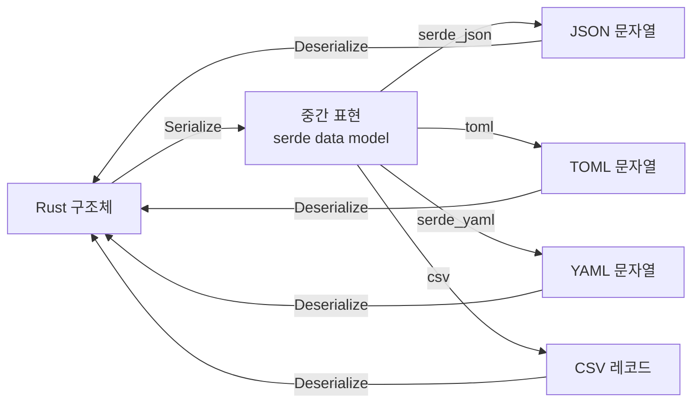

# serde 기본

## 22.1 serde 기본: Serialize와 Deserialize



### Cargo.toml 설정

```toml
[dependencies]
serde = { version = "1", features = ["derive"] }
serde_json = "1"
toml = "0.8"
serde_yaml = "0.9"
csv = "1"
```

### 기본 사용법

```rust,editable
use serde::{Serialize, Deserialize};

#[derive(Debug, Serialize, Deserialize)]
struct User {
    name: String,
    age: u32,
    email: String,
    is_active: bool,
}

fn main() {
    // Rust 구조체 -> JSON (직렬화)
    let user = User {
        name: "김철수".to_string(),
        age: 28,
        email: "chulsoo@example.com".to_string(),
        is_active: true,
    };

    let json = serde_json::to_string(&user).unwrap();
    println!("JSON: {}", json);

    // 보기 좋은 JSON
    let pretty_json = serde_json::to_string_pretty(&user).unwrap();
    println!("Pretty JSON:\n{}", pretty_json);

    // JSON -> Rust 구조체 (역직렬화)
    let json_str = r#"
    {
        "name": "이영희",
        "age": 25,
        "email": "younghee@example.com",
        "is_active": false
    }"#;

    let parsed: User = serde_json::from_str(json_str).unwrap();
    println!("파싱된 사용자: {:?}", parsed);
}
```

---

## 22.2 serde_json 심화

### 동적 JSON 처리: serde_json::Value

구조를 미리 알 수 없는 JSON을 처리할 때 `Value` 타입을 사용합니다.

```rust,editable
use serde_json::{json, Value};

fn main() {
    // json! 매크로로 동적 JSON 생성
    let data = json!({
        "name": "API 응답",
        "status": 200,
        "data": {
            "items": ["사과", "바나나", "체리"],
            "total": 3
        },
        "metadata": null
    });

    // 인덱싱으로 접근
    println!("상태: {}", data["status"]);
    println!("첫 번째 항목: {}", data["data"]["items"][0]);

    // 안전한 접근
    if let Some(total) = data["data"]["total"].as_u64() {
        println!("총 개수: {}", total);
    }

    // Value를 구조체로 변환
    #[derive(serde::Deserialize, Debug)]
    struct ApiResponse {
        name: String,
        status: u32,
    }

    let response: ApiResponse = serde_json::from_value(data.clone()).unwrap();
    println!("응답: {:?}", response);
}
```

### 열거형 직렬화

```rust,editable
use serde::{Serialize, Deserialize};

// 기본 열거형 직렬화 (외부 태깅)
#[derive(Debug, Serialize, Deserialize)]
enum Shape {
    Circle { radius: f64 },
    Rectangle { width: f64, height: f64 },
    Triangle { base: f64, height: f64 },
}

// 내부 태깅
#[derive(Debug, Serialize, Deserialize)]
#[serde(tag = "type")]
enum Event {
    #[serde(rename = "click")]
    Click { x: i32, y: i32 },
    #[serde(rename = "keypress")]
    KeyPress { key: String },
    #[serde(rename = "scroll")]
    Scroll { delta: f64 },
}

// 인접 태깅
#[derive(Debug, Serialize, Deserialize)]
#[serde(tag = "t", content = "c")]
enum Message {
    Text(String),
    Image { url: String, width: u32 },
}

fn main() {
    // 외부 태깅
    let shape = Shape::Circle { radius: 5.0 };
    let json = serde_json::to_string_pretty(&shape).unwrap();
    println!("외부 태깅:\n{}\n", json);

    // 내부 태깅
    let event = Event::Click { x: 100, y: 200 };
    let json = serde_json::to_string_pretty(&event).unwrap();
    println!("내부 태깅:\n{}\n", json);

    // 인접 태깅
    let msg = Message::Text("안녕하세요".to_string());
    let json = serde_json::to_string_pretty(&msg).unwrap();
    println!("인접 태깅:\n{}\n", json);

    // 역직렬화
    let event_json = r#"{"type": "keypress", "key": "Enter"}"#;
    let event: Event = serde_json::from_str(event_json).unwrap();
    println!("역직렬화: {:?}", event);
}
```

---

## 22.3 TOML, YAML, CSV

### TOML (설정 파일)

```rust,editable
use serde::{Serialize, Deserialize};

#[derive(Debug, Serialize, Deserialize)]
struct Config {
    title: String,
    database: DatabaseConfig,
    server: ServerConfig,
}

#[derive(Debug, Serialize, Deserialize)]
struct DatabaseConfig {
    host: String,
    port: u16,
    name: String,
    max_connections: u32,
}

#[derive(Debug, Serialize, Deserialize)]
struct ServerConfig {
    host: String,
    port: u16,
    workers: usize,
}

fn main() {
    let toml_str = r#"
        title = "나의 프로젝트"

        [database]
        host = "localhost"
        port = 5432
        name = "mydb"
        max_connections = 10

        [server]
        host = "0.0.0.0"
        port = 8080
        workers = 4
    "#;

    // TOML -> Rust 구조체
    let config: Config = toml::from_str(toml_str).unwrap();
    println!("설정: {:#?}", config);

    // Rust 구조체 -> TOML
    let output = toml::to_string_pretty(&config).unwrap();
    println!("TOML 출력:\n{}", output);
}
```

### YAML

```rust,editable
use serde::{Serialize, Deserialize};

#[derive(Debug, Serialize, Deserialize)]
struct DockerCompose {
    version: String,
    services: std::collections::HashMap<String, Service>,
}

#[derive(Debug, Serialize, Deserialize)]
struct Service {
    image: String,
    ports: Vec<String>,
    #[serde(default)]
    environment: Vec<String>,
}

fn main() {
    let yaml_str = r#"
version: "3.8"
services:
  web:
    image: nginx:latest
    ports:
      - "80:80"
      - "443:443"
    environment:
      - NGINX_HOST=example.com
  db:
    image: postgres:15
    ports:
      - "5432:5432"
    environment:
      - POSTGRES_PASSWORD=secret
"#;

    let compose: DockerCompose = serde_yaml::from_str(yaml_str).unwrap();
    println!("서비스 목록:");
    for (name, service) in &compose.services {
        println!("  {}: {} (포트: {:?})", name, service.image, service.ports);
    }
}
```

### CSV

```rust,editable
use serde::{Serialize, Deserialize};

#[derive(Debug, Serialize, Deserialize)]
struct Record {
    이름: String,
    #[serde(rename = "나이")]
    age: u32,
    #[serde(rename = "점수")]
    score: f64,
}

fn main() {
    // CSV 읽기
    let csv_data = "이름,나이,점수\n김철수,28,95.5\n이영희,25,88.0\n박민수,30,92.3";

    let mut reader = csv::Reader::from_reader(csv_data.as_bytes());
    let mut records: Vec<Record> = Vec::new();

    for result in reader.deserialize() {
        let record: Record = result.unwrap();
        records.push(record);
    }

    println!("레코드 수: {}", records.len());
    for r in &records {
        println!("{:?}", r);
    }

    // CSV 쓰기
    let mut writer = csv::Writer::from_writer(Vec::new());
    for r in &records {
        writer.serialize(r).unwrap();
    }
    let output = String::from_utf8(writer.into_inner().unwrap()).unwrap();
    println!("\nCSV 출력:\n{}", output);
}
```
