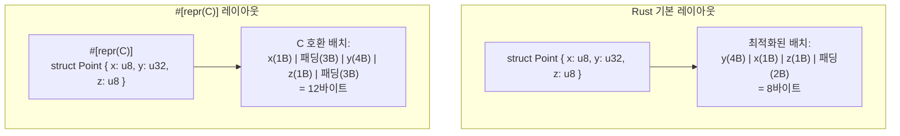
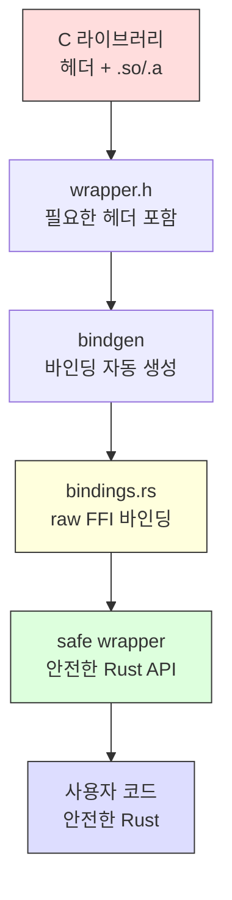

# FFI (Foreign Function Interface) <span class="badge-advanced">고급</span>

FFI를 사용하면 Rust에서 C 라이브러리를 호출하거나, C/C++ 프로그램에서 Rust 함수를 호출할 수 있습니다. 이 장에서는 안전한 FFI 사용법을 다룹니다.

---

## 23.1 C에서 Rust 호출, Rust에서 C 호출

```mermaid
graph LR
    subgraph "Rust 프로그램"
        A[Rust 코드]
        B["extern \"C\" 블록<br>(C 함수 선언)"]
        C["#[no_mangle]<br>pub extern \"C\" fn<br>(Rust 함수 노출)"]
    end
    subgraph "C 라이브러리"
        D[C 함수]
        E[C 헤더 파일]
    end
    A --> B
    B -->|"unsafe 호출"| D
    E -->|"bindgen"| B
    C -->|"링크"| D
```

### Rust에서 C 함수 호출

```rust,editable
// libc의 C 함수를 선언
extern "C" {
    fn abs(input: i32) -> i32;
    fn sqrt(x: f64) -> f64;
}

fn main() {
    // C 함수 호출은 항상 unsafe
    unsafe {
        println!("abs(-42) = {}", abs(-42));
        println!("sqrt(144.0) = {}", sqrt(144.0));
    }
}
```

<div class="warning-box">
<strong>⚠️ unsafe가 필요한 이유</strong><br>
Rust 컴파일러는 외부 함수의 안전성을 검증할 수 없습니다. C 함수가 null 포인터를 반환하거나, 메모리를 잘못 접근하거나, 정의되지 않은 동작을 할 수 있기 때문에, 호출자가 안전성을 보장해야 합니다.
</div>

### C 문자열 처리

```rust,editable
use std::ffi::{CStr, CString};
use std::os::raw::c_char;

// C 함수 시뮬레이션
extern "C" {
    fn strlen(s: *const c_char) -> usize;
}

fn main() {
    // Rust 문자열 -> C 문자열
    let rust_string = "Hello, FFI!";
    let c_string = CString::new(rust_string).expect("CString 생성 실패");

    // C 함수에 전달
    let len = unsafe { strlen(c_string.as_ptr()) };
    println!("C strlen 결과: {}", len);

    // C 문자열 -> Rust 문자열
    let c_str: &CStr = c_string.as_c_str();
    let rust_str: &str = c_str.to_str().expect("UTF-8 변환 실패");
    println!("Rust 문자열: {}", rust_str);

    // null 바이트가 포함된 문자열은 에러
    match CString::new("hello\0world") {
        Ok(_) => println!("성공"),
        Err(e) => println!("에러: {} (위치: {})", e, e.nul_position()),
    }
}
```

### Rust 함수를 C에서 호출

```rust,editable
use std::ffi::{CStr, CString};
use std::os::raw::{c_char, c_int};

// C에서 호출할 수 있는 Rust 함수
// #[no_mangle]: 이름 맹글링 비활성화
// extern "C": C 호출 규약 사용
#[no_mangle]
pub extern "C" fn rust_add(a: c_int, b: c_int) -> c_int {
    a + b
}

#[no_mangle]
pub extern "C" fn rust_greet(name: *const c_char) -> *mut c_char {
    // null 포인터 검사
    if name.is_null() {
        let empty = CString::new("").unwrap();
        return empty.into_raw();
    }

    let c_str = unsafe { CStr::from_ptr(name) };
    let name_str = c_str.to_str().unwrap_or("unknown");
    let greeting = format!("안녕하세요, {}!", name_str);
    let c_greeting = CString::new(greeting).unwrap();

    c_greeting.into_raw() // 소유권을 C로 이전
}

// C에서 할당한 문자열을 해제하는 함수도 제공해야 함
#[no_mangle]
pub extern "C" fn rust_free_string(s: *mut c_char) {
    if !s.is_null() {
        unsafe {
            let _ = CString::from_raw(s); // 소유권 회수 후 드롭
        }
    }
}

fn main() {
    // Rust 내에서 테스트
    let result = rust_add(3, 7);
    println!("rust_add(3, 7) = {}", result);

    let name = CString::new("세계").unwrap();
    let greeting_ptr = rust_greet(name.as_ptr());
    let greeting = unsafe { CStr::from_ptr(greeting_ptr) };
    println!("{}", greeting.to_str().unwrap());

    // 메모리 해제
    rust_free_string(greeting_ptr);
}
```

해당 C 헤더 파일은 다음과 같습니다:

```c
// rust_lib.h
#ifndef RUST_LIB_H
#define RUST_LIB_H

#include <stdint.h>

int32_t rust_add(int32_t a, int32_t b);
char* rust_greet(const char* name);
void rust_free_string(char* s);

#endif
```

---

## 23.2 `#[repr(C)]`와 메모리 레이아웃

Rust의 기본 구조체 레이아웃은 최적화를 위해 필드 순서가 변경될 수 있습니다. C와 호환하려면 `#[repr(C)]`를 사용해야 합니다.



```rust,editable
// C 호환 구조체
#[repr(C)]
#[derive(Debug)]
struct Point {
    x: f64,
    y: f64,
}

#[repr(C)]
#[derive(Debug)]
struct Rectangle {
    origin: Point,
    width: f64,
    height: f64,
}

// repr(C) 열거형
#[repr(C)]
#[derive(Debug)]
enum Color {
    Red = 0,
    Green = 1,
    Blue = 2,
}

// repr(u8) - 크기를 지정한 열거형
#[repr(u8)]
#[derive(Debug)]
enum Status {
    Active = 1,
    Inactive = 0,
    Pending = 2,
}

fn main() {
    let rect = Rectangle {
        origin: Point { x: 1.0, y: 2.0 },
        width: 10.0,
        height: 5.0,
    };
    println!("사각형: {:?}", rect);
    println!("Point 크기: {} 바이트", std::mem::size_of::<Point>());
    println!("Rectangle 크기: {} 바이트", std::mem::size_of::<Rectangle>());
    println!("Color 크기: {} 바이트", std::mem::size_of::<Color>());
    println!("Status 크기: {} 바이트", std::mem::size_of::<Status>());

    // 메모리 레이아웃 확인
    #[repr(C)]
    struct Padded {
        a: u8,   // 1바이트
        b: u32,  // 4바이트 (3바이트 패딩 후)
        c: u8,   // 1바이트 (3바이트 패딩 후)
    }

    #[repr(C, packed)]
    struct Packed {
        a: u8,
        b: u32,
        c: u8,
    }

    println!("\nPadded 크기: {} 바이트", std::mem::size_of::<Padded>());
    println!("Packed 크기: {} 바이트", std::mem::size_of::<Packed>());
}
```

<div class="warning-box">
<strong>⚠️ repr(packed) 주의사항</strong><br>
<code>#[repr(packed)]</code>는 패딩을 제거하지만, 정렬되지 않은(unaligned) 필드 접근은 일부 아키텍처에서 정의되지 않은 동작을 유발할 수 있습니다. 필드 참조를 만들면 컴파일 에러가 발생합니다.
</div>

---

## 23.3 Opaque 타입과 콜백

C 라이브러리가 불투명 타입(opaque type)을 사용하는 경우의 처리 방법입니다.

```rust,editable
use std::os::raw::{c_int, c_void};

// C의 불투명 구조체 표현
#[repr(C)]
struct OpaqueHandle {
    _private: [u8; 0], // 크기가 0인 배열로 불투명 타입 표현
}

// C 콜백 함수 타입
type CCallback = extern "C" fn(c_int, *mut c_void);

// 안전한 Rust 래퍼
struct SafeHandle {
    _inner: *mut OpaqueHandle,
}

impl SafeHandle {
    fn new() -> Self {
        // 실제로는 C 함수로 핸들을 생성
        println!("핸들 생성");
        SafeHandle {
            _inner: std::ptr::null_mut(),
        }
    }
}

impl Drop for SafeHandle {
    fn drop(&mut self) {
        // 실제로는 C 함수로 핸들을 해제
        println!("핸들 해제");
    }
}

// 콜백 예제
extern "C" fn my_callback(value: c_int, _user_data: *mut c_void) {
    println!("콜백 호출됨: 값 = {}", value);
}

fn main() {
    let handle = SafeHandle::new();

    // 콜백 함수 포인터 사용
    let cb: CCallback = my_callback;
    cb(42, std::ptr::null_mut());

    // 클로저를 콜백으로 변환 (트램폴린 패턴)
    let mut context = String::from("콘텍스트 데이터");

    extern "C" fn trampoline(value: c_int, user_data: *mut c_void) {
        let ctx = unsafe { &mut *(user_data as *mut String) };
        println!("트램폴린: 값 = {}, 컨텍스트 = {}", value, ctx);
    }

    let ctx_ptr = &mut context as *mut String as *mut c_void;
    trampoline(99, ctx_ptr);

    drop(handle);
}
```

---

## 23.4 bindgen

`bindgen`은 C 헤더 파일에서 Rust FFI 바인딩을 자동으로 생성하는 도구입니다.

### 설치 및 기본 사용

```bash
# bindgen CLI 설치
cargo install bindgen-cli

# C 헤더에서 바인딩 생성
bindgen wrapper.h -o bindings.rs
```

### build.rs에서 자동 생성

```rust,editable
// build.rs 예제 (빌드 스크립트)
fn main() {
    // 실제로는 bindgen::Builder를 사용
    println!("=== build.rs 예제 ===");
    println!("bindgen은 빌드 스크립트에서 사용합니다.");

    // 아래는 실제 build.rs 코드 구조입니다:
    let build_script = r#"
// build.rs
use std::env;
use std::path::PathBuf;

fn main() {
    // C 라이브러리 링크
    println!("cargo:rustc-link-lib=mylib");
    println!("cargo:rustc-link-search=/usr/local/lib");

    // 헤더 파일 변경 시 재빌드
    println!("cargo:rerun-if-changed=wrapper.h");

    // bindgen으로 바인딩 생성
    let bindings = bindgen::Builder::default()
        .header("wrapper.h")
        .parse_callbacks(Box::new(bindgen::CargoCallbacks::new()))
        .allowlist_function("my_.*")     // my_로 시작하는 함수만
        .allowlist_type("MyStruct")       // 특정 타입만
        .blocklist_item("SKIP_THIS")      // 제외할 항목
        .derive_debug(true)               // Debug 자동 구현
        .derive_default(true)             // Default 자동 구현
        .generate()
        .expect("바인딩 생성 실패");

    let out_path = PathBuf::from(env::var("OUT_DIR").unwrap());
    bindings
        .write_to_file(out_path.join("bindings.rs"))
        .expect("바인딩 파일 쓰기 실패");
}
"#;
    println!("{}", build_script);
}
```

### Cargo.toml 설정

```toml
[build-dependencies]
bindgen = "0.70"

[dependencies]
libc = "0.2"
```

### 생성된 바인딩 사용

```rust,editable
fn main() {
    // 실제로는 아래와 같이 사용합니다:
    // include!(concat!(env!("OUT_DIR"), "/bindings.rs"));
    //
    // 그러면 C 헤더의 함수/타입이 Rust에서 사용 가능해집니다:
    // unsafe { my_function(42) };

    println!("bindgen 사용법:");
    println!("1. wrapper.h에 C 헤더 포함");
    println!("2. build.rs에서 bindgen 실행");
    println!("3. include! 매크로로 바인딩 포함");
    println!("4. unsafe 블록에서 C 함수 호출");
}
```

---

## 23.5 안전한 래퍼 만들기

unsafe FFI 호출을 안전한 Rust API로 감싸는 것이 핵심입니다.

```rust,editable
use std::ffi::{CStr, CString};
use std::os::raw::{c_char, c_int};

// ===== C API 시뮬레이션 =====

// C 라이브러리의 "불안전한" API (실제로는 extern "C" 블록)
mod ffi {
    use std::os::raw::{c_char, c_int};

    // 에러 코드
    pub const SUCCESS: c_int = 0;
    pub const ERR_NULL_PTR: c_int = -1;
    pub const ERR_INVALID: c_int = -2;

    // 실제로는 extern "C" 블록에 선언
    pub fn db_open(path: *const c_char, handle: *mut *mut u8) -> c_int {
        if path.is_null() || handle.is_null() {
            return ERR_NULL_PTR;
        }
        // 시뮬레이션: 핸들 할당
        unsafe {
            *handle = Box::into_raw(Box::new(1u8));
        }
        println!("  [C] 데이터베이스 열기");
        SUCCESS
    }

    pub fn db_execute(handle: *mut u8, query: *const c_char) -> c_int {
        if handle.is_null() || query.is_null() {
            return ERR_NULL_PTR;
        }
        let q = unsafe { std::ffi::CStr::from_ptr(query) };
        println!("  [C] 쿼리 실행: {}", q.to_str().unwrap_or("?"));
        SUCCESS
    }

    pub fn db_close(handle: *mut u8) -> c_int {
        if handle.is_null() {
            return ERR_NULL_PTR;
        }
        unsafe {
            let _ = Box::from_raw(handle);
        }
        println!("  [C] 데이터베이스 닫기");
        SUCCESS
    }
}

// ===== 안전한 Rust 래퍼 =====

#[derive(Debug)]
enum DbError {
    NullPointer,
    InvalidInput,
    Unknown(i32),
}

impl std::fmt::Display for DbError {
    fn fmt(&self, f: &mut std::fmt::Formatter<'_>) -> std::fmt::Result {
        match self {
            DbError::NullPointer => write!(f, "null 포인터 에러"),
            DbError::InvalidInput => write!(f, "잘못된 입력"),
            DbError::Unknown(code) => write!(f, "알 수 없는 에러: {}", code),
        }
    }
}

fn check_error(code: c_int) -> Result<(), DbError> {
    match code {
        ffi::SUCCESS => Ok(()),
        ffi::ERR_NULL_PTR => Err(DbError::NullPointer),
        ffi::ERR_INVALID => Err(DbError::InvalidInput),
        other => Err(DbError::Unknown(other)),
    }
}

// RAII로 자동 해제를 보장하는 안전한 래퍼
struct Database {
    handle: *mut u8,
}

impl Database {
    fn open(path: &str) -> Result<Self, DbError> {
        let c_path = CString::new(path).map_err(|_| DbError::InvalidInput)?;
        let mut handle: *mut u8 = std::ptr::null_mut();

        check_error(ffi::db_open(c_path.as_ptr(), &mut handle))?;

        Ok(Database { handle })
    }

    fn execute(&self, query: &str) -> Result<(), DbError> {
        let c_query = CString::new(query).map_err(|_| DbError::InvalidInput)?;
        check_error(ffi::db_execute(self.handle, c_query.as_ptr()))
    }
}

impl Drop for Database {
    fn drop(&mut self) {
        if !self.handle.is_null() {
            let _ = ffi::db_close(self.handle);
            self.handle = std::ptr::null_mut();
        }
    }
}

// Send와 Sync는 신중히 결정 (이 예제에서는 구현하지 않음)

fn main() {
    println!("=== 안전한 래퍼 사용 ===\n");

    match Database::open("test.db") {
        Ok(db) => {
            db.execute("CREATE TABLE users (id INT, name TEXT)").unwrap();
            db.execute("INSERT INTO users VALUES (1, '김철수')").unwrap();
            println!("\n작업 완료. 스코프 벗어나면 자동 해제.");
            // db는 스코프를 벗어나며 자동으로 close 호출
        }
        Err(e) => println!("에러: {}", e),
    }

    println!("\n프로그램 종료.");
}
```

<div class="tip-box">
<strong>💡 안전한 FFI 래퍼 설계 원칙</strong><br>
<ol>
<li><strong>RAII</strong>: <code>Drop</code>으로 자원 자동 해제</li>
<li><strong>에러 변환</strong>: C 에러 코드를 <code>Result</code>로 변환</li>
<li><strong>문자열 변환</strong>: <code>CString</code>/<code>CStr</code>로 안전하게 처리</li>
<li><strong>null 검사</strong>: 포인터를 사용하기 전에 null 확인</li>
<li><strong>Send/Sync 신중히</strong>: 스레드 안전성을 보장할 수 있을 때만 구현</li>
</ol>
</div>

---

## 23.6 실전: 간단한 C 라이브러리 래핑 전체 과정



### 프로젝트 구조

```
my-ffi-project/
├── Cargo.toml
├── build.rs              # bindgen 실행
├── wrapper.h             # C 헤더 포함
├── src/
│   ├── lib.rs            # 안전한 래퍼
│   ├── ffi.rs            # raw 바인딩 (자동 생성 포함)
│   └── main.rs           # 사용 예제
```

```rust,editable
// 프로젝트 구조 시뮬레이션

// ffi.rs - raw 바인딩 (보통 bindgen이 자동 생성)
mod ffi_raw {
    use std::os::raw::{c_char, c_int, c_double};

    // extern "C" {
    //     pub fn math_init() -> c_int;
    //     pub fn math_add(a: c_double, b: c_double) -> c_double;
    //     pub fn math_version() -> *const c_char;
    //     pub fn math_cleanup();
    // }

    // 시뮬레이션
    pub fn math_init() -> c_int { 0 }
    pub fn math_add(a: c_double, b: c_double) -> c_double { a + b }
    pub fn math_version() -> String { "1.0.0".to_string() }
    pub fn math_cleanup() {}
}

// lib.rs - 안전한 래퍼
mod math_lib {
    use super::ffi_raw;

    pub struct MathLib {
        initialized: bool,
    }

    impl MathLib {
        pub fn new() -> Result<Self, String> {
            let result = ffi_raw::math_init();
            if result != 0 {
                return Err(format!("초기화 실패: {}", result));
            }
            Ok(MathLib { initialized: true })
        }

        pub fn add(&self, a: f64, b: f64) -> f64 {
            assert!(self.initialized, "라이브러리가 초기화되지 않음");
            ffi_raw::math_add(a, b)
        }

        pub fn version(&self) -> String {
            ffi_raw::math_version()
        }
    }

    impl Drop for MathLib {
        fn drop(&mut self) {
            if self.initialized {
                ffi_raw::math_cleanup();
                self.initialized = false;
                println!("MathLib 정리 완료");
            }
        }
    }
}

fn main() {
    let lib = math_lib::MathLib::new().expect("초기화 실패");

    println!("버전: {}", lib.version());
    println!("3.5 + 2.7 = {}", lib.add(3.5, 2.7));

    // 자동 정리
}
```

---

<div class="exercise-box">

### 연습문제

**연습 1**: 다음 C 구조체와 함수에 대한 Rust FFI 바인딩과 안전한 래퍼를 작성하세요.

```c
// timer.h
typedef struct {
    uint64_t start_ns;
    uint64_t elapsed_ns;
    int running;
} Timer;

int timer_create(Timer** out);
int timer_start(Timer* t);
int timer_stop(Timer* t);
uint64_t timer_elapsed_ms(const Timer* t);
void timer_destroy(Timer* t);
```

```rust,editable
use std::os::raw::c_int;

// 1. #[repr(C)] 구조체를 정의하세요
// 2. extern "C" 블록에 함수를 선언하세요
// 3. SafeTimer 래퍼를 구현하세요 (RAII 포함)

fn main() {
    println!("Timer FFI 래퍼를 구현하세요!");
    // 구현 후:
    // let timer = SafeTimer::new()?;
    // timer.start()?;
    // // ... 작업 ...
    // timer.stop()?;
    // println!("경과: {}ms", timer.elapsed_ms());
}
```

**연습 2**: Rust 함수를 C에서 호출할 수 있도록 만드세요. 문자열 배열을 받아 정렬하여 반환하는 함수입니다.

```rust,editable
use std::ffi::{CStr, CString};
use std::os::raw::{c_char, c_int};

// C에서 호출 가능한 정렬 함수를 구현하세요
// 시그니처: fn sort_strings(arr: *mut *mut c_char, len: c_int) -> c_int
// 반환값: 성공 시 0, 실패 시 -1

// 힌트:
// 1. null 검사
// 2. *mut *mut c_char -> Vec<String> 변환
// 3. 정렬
// 4. 결과를 원래 배열에 다시 쓰기

fn main() {
    println!("C 호환 정렬 함수를 구현하세요!");
}
```

</div>

---

<div class="quiz-box" onclick="this.classList.toggle('show-answer')">

### 퀴즈 1
`#[repr(C)]`를 사용하지 않으면 FFI에서 어떤 문제가 발생할 수 있나요?

<div class="quiz-answer">
Rust 컴파일러는 성능 최적화를 위해 구조체의 필드 순서를 재배치하거나 패딩을 변경할 수 있습니다. <code>#[repr(C)]</code> 없이는 Rust와 C의 메모리 레이아웃이 달라져서, C 코드가 잘못된 메모리 위치에서 필드를 읽게 되어 정의되지 않은 동작이 발생합니다.
</div>
</div>

<div class="quiz-box" onclick="this.classList.toggle('show-answer')">

### 퀴즈 2
`CString`과 `CStr`의 차이점은 무엇인가요?

<div class="quiz-answer">
<strong>CString</strong>은 소유된(owned) null 종료 C 문자열입니다. 힙에 할당되며 <code>Drop</code>으로 자동 해제됩니다. Rust에서 C로 문자열을 전달할 때 사용합니다.<br>
<strong>CStr</strong>은 빌려온(borrowed) null 종료 C 문자열의 참조입니다. C에서 받은 포인터를 안전하게 Rust 문자열로 변환할 때 사용합니다.<br>
관계는 <code>String</code>과 <code>&str</code>의 관계와 유사합니다.
</div>
</div>

<div class="quiz-box" onclick="this.classList.toggle('show-answer')">

### 퀴즈 3
FFI에서 `into_raw()`로 반환한 메모리는 왜 별도의 해제 함수가 필요한가요?

<div class="quiz-answer">
<code>CString::into_raw()</code>는 소유권을 원시 포인터로 이전하여 Rust의 자동 메모리 관리(Drop)를 우회합니다. C 코드가 이 메모리를 사용하는 동안 Rust가 해제하면 안 되기 때문입니다. C 코드가 사용을 마치면 <code>CString::from_raw()</code>로 소유권을 되찾아 정상적으로 해제해야 합니다. C의 <code>free()</code>로 해제하면 안 됩니다. 할당자가 다를 수 있기 때문입니다.
</div>
</div>

---

<div class="summary-box">

### 요약

| 주제 | 핵심 개념 |
|------|----------|
| **extern "C"** | C 함수를 Rust에서 선언하고 호출 (unsafe 필요) |
| **#[no_mangle]** | Rust 함수를 C에서 호출 가능하게 이름 맹글링 비활성화 |
| **#[repr(C)]** | C 호환 메모리 레이아웃 보장 |
| **CString / CStr** | Rust ↔ C 문자열 변환 |
| **bindgen** | C 헤더에서 Rust 바인딩 자동 생성 |
| **안전한 래퍼** | RAII, Result, null 검사로 unsafe를 캡슐화 |
| **콜백** | 함수 포인터, 트램폴린 패턴으로 클로저 전달 |
| **메모리 관리** | into_raw/from_raw로 소유권 이전/회수 |

</div>
