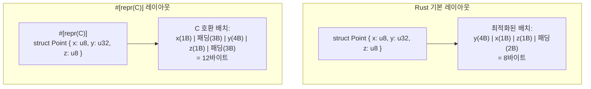

# `#[repr(C)]`와 메모리 레이아웃, 콜백

## `#[repr(C)]`와 메모리 레이아웃

Rust의 기본 구조체 레이아웃은 최적화를 위해 필드 순서가 변경될 수 있습니다. C와 호환하려면 `#[repr(C)]`를 사용해야 합니다.



```rust,editable
// C 호환 구조체
#[repr(C)]
#[derive(Debug)]
struct Point {
    x: f64,
    y: f64,
}

#[repr(C)]
#[derive(Debug)]
struct Rectangle {
    origin: Point,
    width: f64,
    height: f64,
}

// repr(C) 열거형
#[repr(C)]
#[derive(Debug)]
enum Color {
    Red = 0,
    Green = 1,
    Blue = 2,
}

// repr(u8) - 크기를 지정한 열거형
#[repr(u8)]
#[derive(Debug)]
enum Status {
    Active = 1,
    Inactive = 0,
    Pending = 2,
}

fn main() {
    let rect = Rectangle {
        origin: Point { x: 1.0, y: 2.0 },
        width: 10.0,
        height: 5.0,
    };
    println!("사각형: {:?}", rect);
    println!("Point 크기: {} 바이트", std::mem::size_of::<Point>());
    println!("Rectangle 크기: {} 바이트", std::mem::size_of::<Rectangle>());
    println!("Color 크기: {} 바이트", std::mem::size_of::<Color>());
    println!("Status 크기: {} 바이트", std::mem::size_of::<Status>());

    // 메모리 레이아웃 확인
    #[repr(C)]
    struct Padded {
        a: u8,   // 1바이트
        b: u32,  // 4바이트 (3바이트 패딩 후)
        c: u8,   // 1바이트 (3바이트 패딩 후)
    }

    #[repr(C, packed)]
    struct Packed {
        a: u8,
        b: u32,
        c: u8,
    }

    println!("\nPadded 크기: {} 바이트", std::mem::size_of::<Padded>());
    println!("Packed 크기: {} 바이트", std::mem::size_of::<Packed>());
}
```

<div class="warning-box">
<strong>⚠️ repr(packed) 주의사항</strong><br>
<code>#[repr(packed)]</code>는 패딩을 제거하지만, 정렬되지 않은(unaligned) 필드 접근은 일부 아키텍처에서 정의되지 않은 동작을 유발할 수 있습니다. 필드 참조를 만들면 컴파일 에러가 발생합니다.
</div>

---

## Opaque 타입과 콜백

C 라이브러리가 불투명 타입(opaque type)을 사용하는 경우의 처리 방법입니다.

```rust,editable
use std::os::raw::{c_int, c_void};

// C의 불투명 구조체 표현
#[repr(C)]
struct OpaqueHandle {
    _private: [u8; 0], // 크기가 0인 배열로 불투명 타입 표현
}

// C 콜백 함수 타입
type CCallback = extern "C" fn(c_int, *mut c_void);

// 안전한 Rust 래퍼
struct SafeHandle {
    _inner: *mut OpaqueHandle,
}

impl SafeHandle {
    fn new() -> Self {
        // 실제로는 C 함수로 핸들을 생성
        println!("핸들 생성");
        SafeHandle {
            _inner: std::ptr::null_mut(),
        }
    }
}

impl Drop for SafeHandle {
    fn drop(&mut self) {
        // 실제로는 C 함수로 핸들을 해제
        println!("핸들 해제");
    }
}

// 콜백 예제
extern "C" fn my_callback(value: c_int, _user_data: *mut c_void) {
    println!("콜백 호출됨: 값 = {}", value);
}

fn main() {
    let handle = SafeHandle::new();

    // 콜백 함수 포인터 사용
    let cb: CCallback = my_callback;
    cb(42, std::ptr::null_mut());

    // 클로저를 콜백으로 변환 (트램폴린 패턴)
    let mut context = String::from("콘텍스트 데이터");

    extern "C" fn trampoline(value: c_int, user_data: *mut c_void) {
        let ctx = unsafe { &mut *(user_data as *mut String) };
        println!("트램폴린: 값 = {}, 컨텍스트 = {}", value, ctx);
    }

    let ctx_ptr = &mut context as *mut String as *mut c_void;
    trampoline(99, ctx_ptr);

    drop(handle);
}
```
