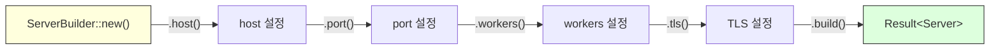
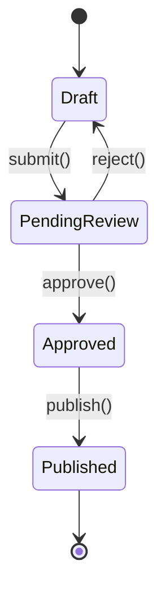
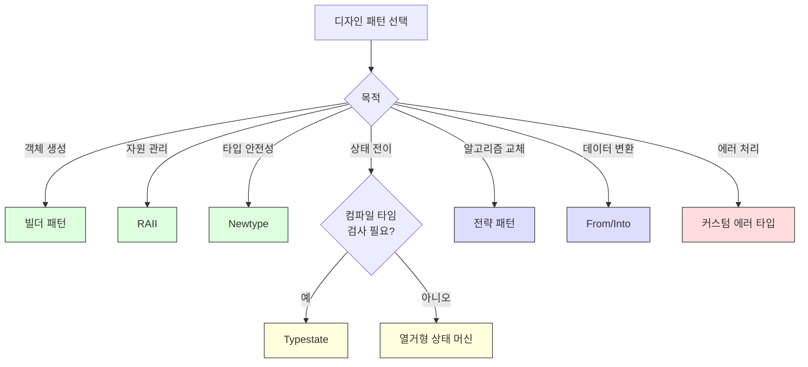

# 디자인 패턴 <span class="badge-advanced">고급</span>

Rust에서는 소유권, 트레이트, 열거형 등의 고유 특성 덕분에 전통적인 디자인 패턴이 더 안전하고 간결하게 구현됩니다. 이 장에서는 Rust에서 자주 사용되는 디자인 패턴을 상세히 다룹니다.

---

## 24.1 빌더 패턴 (Builder Pattern)

빌더 패턴은 복잡한 객체를 단계적으로 구성할 때 사용합니다. Rust에서는 소유권을 활용한 체이닝 방식이 일반적입니다.



```rust,editable
#[derive(Debug)]
struct Server {
    host: String,
    port: u16,
    workers: usize,
    tls: bool,
    max_connections: u32,
    log_level: String,
}

#[derive(Debug)]
struct ServerBuilder {
    host: String,
    port: Option<u16>,
    workers: Option<usize>,
    tls: bool,
    max_connections: u32,
    log_level: String,
}

impl ServerBuilder {
    fn new(host: &str) -> Self {
        ServerBuilder {
            host: host.to_string(),
            port: None,
            workers: None,
            tls: false,
            max_connections: 1000,
            log_level: "info".to_string(),
        }
    }

    fn port(mut self, port: u16) -> Self {
        self.port = Some(port);
        self
    }

    fn workers(mut self, n: usize) -> Self {
        self.workers = Some(n);
        self
    }

    fn tls(mut self, enabled: bool) -> Self {
        self.tls = enabled;
        self
    }

    fn max_connections(mut self, n: u32) -> Self {
        self.max_connections = n;
        self
    }

    fn log_level(mut self, level: &str) -> Self {
        self.log_level = level.to_string();
        self
    }

    fn build(self) -> Result<Server, String> {
        let port = self.port.ok_or("포트가 설정되지 않았습니다")?;
        let workers = self.workers.unwrap_or_else(num_cpus);

        if port == 0 {
            return Err("포트는 0이 될 수 없습니다".to_string());
        }

        Ok(Server {
            host: self.host,
            port,
            workers,
            tls: self.tls,
            max_connections: self.max_connections,
            log_level: self.log_level,
        })
    }
}

fn num_cpus() -> usize { 4 } // 시뮬레이션

fn main() {
    // 체이닝으로 간결하게 구성
    let server = ServerBuilder::new("0.0.0.0")
        .port(8080)
        .workers(8)
        .tls(true)
        .max_connections(5000)
        .log_level("debug")
        .build()
        .expect("서버 생성 실패");

    println!("서버 설정: {:#?}", server);

    // 최소 설정
    let minimal = ServerBuilder::new("localhost")
        .port(3000)
        .build()
        .expect("서버 생성 실패");

    println!("\n최소 서버: {:#?}", minimal);

    // 유효성 검사 실패
    let err = ServerBuilder::new("localhost")
        .build();
    println!("\n에러: {:?}", err);
}
```

<div class="tip-box">
<strong>💡 빌더 패턴 변형</strong><br>
<ul>
<li><strong>소유권 이동 빌더</strong> (위 예제): <code>self</code>를 소비하여 체이닝. 각 호출 후 빌더 재사용 불가.</li>
<li><strong>가변 참조 빌더</strong>: <code>&mut self</code>를 사용하여 빌더 재사용 가능. 마지막에 <code>.build()</code>에서 클론.</li>
<li><strong>Typestate 빌더</strong>: 필수 필드를 타입 수준에서 보장 (21장 참조).</li>
</ul>
</div>

---

## 24.2 RAII 패턴

RAII(Resource Acquisition Is Initialization)는 자원 획득을 초기화와 결합하고, `Drop` 트레이트로 자동 해제를 보장합니다.

```rust,editable
use std::time::Instant;

// 타이머: 스코프 동안 경과 시간 측정
struct Timer {
    label: String,
    start: Instant,
}

impl Timer {
    fn new(label: &str) -> Self {
        println!("[{}] 시작", label);
        Timer {
            label: label.to_string(),
            start: Instant::now(),
        }
    }
}

impl Drop for Timer {
    fn drop(&mut self) {
        let elapsed = self.start.elapsed();
        println!("[{}] 완료: {:?}", self.label, elapsed);
    }
}

// 잠금: 스코프 동안 잠금 유지
struct SimpleLock {
    name: String,
}

impl SimpleLock {
    fn acquire(name: &str) -> Self {
        println!("잠금 획득: {}", name);
        SimpleLock { name: name.to_string() }
    }
}

impl Drop for SimpleLock {
    fn drop(&mut self) {
        println!("잠금 해제: {}", self.name);
    }
}

// 임시 파일: 스코프 종료 시 삭제
struct TempFile {
    path: String,
}

impl TempFile {
    fn create(path: &str) -> Self {
        println!("임시 파일 생성: {}", path);
        TempFile { path: path.to_string() }
    }

    fn write(&self, content: &str) {
        println!("파일 쓰기: {} <- \"{}\"", self.path, content);
    }
}

impl Drop for TempFile {
    fn drop(&mut self) {
        println!("임시 파일 삭제: {}", self.path);
    }
}

fn process_data() {
    let _timer = Timer::new("데이터 처리");
    let _lock = SimpleLock::acquire("data_mutex");
    let temp = TempFile::create("/tmp/processing.tmp");

    temp.write("중간 결과 데이터");

    // 시뮬레이션: 무거운 작업
    let sum: u64 = (0..1_000_000).sum();
    println!("계산 결과: {}", sum);

    // 함수 종료 시 역순으로 드롭:
    // 1. temp (임시 파일 삭제)
    // 2. _lock (잠금 해제)
    // 3. _timer (경과 시간 출력)
}

fn main() {
    process_data();
    println!("\n모든 자원이 자동으로 해제되었습니다.");
}
```

---

## 24.3 Newtype 패턴 활용

Newtype 패턴으로 도메인별 타입 안전성을 확보합니다.

```rust,editable
use std::fmt;

// 도메인 타입 정의
#[derive(Debug, Clone, PartialEq)]
struct Email(String);

#[derive(Debug, Clone, PartialEq)]
struct Username(String);

#[derive(Debug, Clone, PartialEq)]
struct Password(String);

impl Email {
    fn new(value: &str) -> Result<Self, String> {
        if value.contains('@') && value.contains('.') {
            Ok(Email(value.to_lowercase()))
        } else {
            Err(format!("잘못된 이메일: {}", value))
        }
    }
}

impl Username {
    fn new(value: &str) -> Result<Self, String> {
        if value.len() >= 3 && value.len() <= 20 && value.chars().all(|c| c.is_alphanumeric() || c == '_') {
            Ok(Username(value.to_string()))
        } else {
            Err(format!("잘못된 사용자명: {} (3~20자, 영숫자와 _만 허용)", value))
        }
    }
}

impl Password {
    fn new(value: &str) -> Result<Self, String> {
        if value.len() < 8 {
            return Err("비밀번호는 8자 이상이어야 합니다".to_string());
        }
        Ok(Password(value.to_string()))
    }
}

// Password는 Display에서 값을 숨김
impl fmt::Display for Password {
    fn fmt(&self, f: &mut fmt::Formatter<'_>) -> fmt::Result {
        write!(f, "********")
    }
}

impl fmt::Display for Email {
    fn fmt(&self, f: &mut fmt::Formatter<'_>) -> fmt::Result {
        write!(f, "{}", self.0)
    }
}

impl fmt::Display for Username {
    fn fmt(&self, f: &mut fmt::Formatter<'_>) -> fmt::Result {
        write!(f, "{}", self.0)
    }
}

// 타입 안전한 함수 - 인수 순서 혼동 방지
fn register(username: Username, email: Email, password: Password) {
    println!("등록: {} ({}) [비밀번호: {}]", username, email, password);
}

fn main() {
    let username = Username::new("rust_user").unwrap();
    let email = Email::new("user@Example.COM").unwrap();
    let password = Password::new("secure_password_123").unwrap();

    register(username, email, password);

    // 잘못된 순서로 호출하면 컴파일 에러!
    // register(email, username, password); // 타입 불일치

    // 유효성 검사 실패 예시
    println!("\n유효성 검사:");
    println!("  {:?}", Email::new("invalid"));
    println!("  {:?}", Username::new("ab"));
    println!("  {:?}", Password::new("short"));
}
```

---

## 24.4 상태 패턴 (State Pattern with Enums)

열거형을 사용한 상태 패턴은 Rust에서 가장 자연스러운 패턴 중 하나입니다.



```rust,editable
use std::time::SystemTime;

#[derive(Debug)]
enum PostState {
    Draft {
        content: String,
        last_edited: SystemTime,
    },
    PendingReview {
        content: String,
        submitted_at: SystemTime,
    },
    Approved {
        content: String,
        approved_by: String,
    },
    Published {
        content: String,
        published_at: SystemTime,
        url: String,
    },
}

impl PostState {
    fn new(content: &str) -> Self {
        PostState::Draft {
            content: content.to_string(),
            last_edited: SystemTime::now(),
        }
    }

    fn submit(self) -> Self {
        match self {
            PostState::Draft { content, .. } => {
                println!("리뷰 요청됨");
                PostState::PendingReview {
                    content,
                    submitted_at: SystemTime::now(),
                }
            }
            other => {
                println!("Draft 상태에서만 제출할 수 있습니다.");
                other
            }
        }
    }

    fn approve(self, reviewer: &str) -> Self {
        match self {
            PostState::PendingReview { content, .. } => {
                println!("{}이(가) 승인함", reviewer);
                PostState::Approved {
                    content,
                    approved_by: reviewer.to_string(),
                }
            }
            other => {
                println!("PendingReview 상태에서만 승인할 수 있습니다.");
                other
            }
        }
    }

    fn reject(self, reason: &str) -> Self {
        match self {
            PostState::PendingReview { content, .. } => {
                println!("반려됨: {}", reason);
                PostState::Draft {
                    content,
                    last_edited: SystemTime::now(),
                }
            }
            other => {
                println!("PendingReview 상태에서만 반려할 수 있습니다.");
                other
            }
        }
    }

    fn publish(self) -> Self {
        match self {
            PostState::Approved { content, .. } => {
                let url = format!("/posts/{}", content.len()); // 간단한 URL 생성
                println!("발행됨: {}", url);
                PostState::Published {
                    content,
                    published_at: SystemTime::now(),
                    url,
                }
            }
            other => {
                println!("Approved 상태에서만 발행할 수 있습니다.");
                other
            }
        }
    }

    fn content(&self) -> &str {
        match self {
            PostState::Draft { content, .. }
            | PostState::PendingReview { content, .. }
            | PostState::Approved { content, .. }
            | PostState::Published { content, .. } => content,
        }
    }

    fn state_name(&self) -> &str {
        match self {
            PostState::Draft { .. } => "초안",
            PostState::PendingReview { .. } => "리뷰 대기",
            PostState::Approved { .. } => "승인됨",
            PostState::Published { .. } => "발행됨",
        }
    }
}

fn main() {
    let post = PostState::new("Rust 디자인 패턴 가이드");
    println!("상태: {} - 내용: {}", post.state_name(), post.content());

    let post = post.submit();
    println!("상태: {}", post.state_name());

    // 반려 후 다시 제출
    let post = post.reject("오탈자 수정 필요");
    println!("상태: {}", post.state_name());

    let post = post.submit();
    let post = post.approve("편집장");
    println!("상태: {}", post.state_name());

    let post = post.publish();
    println!("상태: {}", post.state_name());
}
```

---

## 24.5 전략 패턴 (Strategy Pattern)

트레이트 객체 또는 클로저로 런타임에 알고리즘을 교체합니다.

```rust,editable
// 트레이트 객체 방식
trait SortStrategy {
    fn sort(&self, data: &mut Vec<i32>);
    fn name(&self) -> &str;
}

struct BubbleSort;
struct QuickSort;
struct InsertionSort;

impl SortStrategy for BubbleSort {
    fn sort(&self, data: &mut Vec<i32>) {
        let n = data.len();
        for i in 0..n {
            for j in 0..n - 1 - i {
                if data[j] > data[j + 1] {
                    data.swap(j, j + 1);
                }
            }
        }
    }
    fn name(&self) -> &str { "버블 정렬" }
}

impl SortStrategy for QuickSort {
    fn sort(&self, data: &mut Vec<i32>) {
        data.sort(); // 표준 라이브러리 사용 (실제로는 Tim sort)
    }
    fn name(&self) -> &str { "퀵 정렬" }
}

impl SortStrategy for InsertionSort {
    fn sort(&self, data: &mut Vec<i32>) {
        for i in 1..data.len() {
            let key = data[i];
            let mut j = i;
            while j > 0 && data[j - 1] > key {
                data[j] = data[j - 1];
                j -= 1;
            }
            data[j] = key;
        }
    }
    fn name(&self) -> &str { "삽입 정렬" }
}

// 전략을 사용하는 컨텍스트
struct Sorter {
    strategy: Box<dyn SortStrategy>,
}

impl Sorter {
    fn new(strategy: Box<dyn SortStrategy>) -> Self {
        Sorter { strategy }
    }

    fn sort(&self, data: &mut Vec<i32>) {
        println!("정렬 알고리즘: {}", self.strategy.name());
        self.strategy.sort(data);
    }

    // 전략 교체
    fn set_strategy(&mut self, strategy: Box<dyn SortStrategy>) {
        self.strategy = strategy;
    }
}

// 클로저 방식 (더 간결)
fn sort_with<F: Fn(&mut Vec<i32>)>(data: &mut Vec<i32>, strategy: F) {
    strategy(data);
}

fn main() {
    let mut data = vec![64, 34, 25, 12, 22, 11, 90];

    // 트레이트 객체 방식
    let mut sorter = Sorter::new(Box::new(BubbleSort));
    let mut d1 = data.clone();
    sorter.sort(&mut d1);
    println!("결과: {:?}\n", d1);

    // 전략 교체
    sorter.set_strategy(Box::new(InsertionSort));
    let mut d2 = data.clone();
    sorter.sort(&mut d2);
    println!("결과: {:?}\n", d2);

    // 클로저 방식
    let mut d3 = data.clone();
    sort_with(&mut d3, |v| v.sort());
    println!("클로저 정렬: {:?}", d3);

    let mut d4 = data.clone();
    sort_with(&mut d4, |v| v.sort_by(|a, b| b.cmp(a)));
    println!("역순 정렬: {:?}", d4);
}
```

---

## 24.6 이터레이터 체이닝 패턴

Rust의 이터레이터는 지연 평가(lazy evaluation)와 제로 비용 추상화를 제공합니다.

```rust,editable
fn main() {
    let data = vec![
        ("Alice", 85), ("Bob", 92), ("Charlie", 78),
        ("Diana", 96), ("Eve", 88), ("Frank", 71),
        ("Grace", 94), ("Hank", 65), ("Ivy", 90),
    ];

    // 체이닝: 80점 이상 학생의 이름을 점수 순으로 정렬
    let honor_roll: Vec<&str> = data.iter()
        .filter(|(_, score)| *score >= 80)
        .map(|(name, _)| *name)
        .collect::<Vec<_>>()
        .into_iter()
        .collect();
    println!("우등생: {:?}", honor_roll);

    // 통계 계산
    let scores: Vec<i32> = data.iter().map(|(_, s)| *s).collect();
    let count = scores.len();
    let sum: i32 = scores.iter().sum();
    let avg = sum as f64 / count as f64;
    let max = scores.iter().max().unwrap();
    let min = scores.iter().min().unwrap();

    println!("\n통계:");
    println!("  인원: {}, 평균: {:.1}, 최고: {}, 최저: {}", count, avg, max, min);

    // 그룹핑 패턴
    let (passed, failed): (Vec<_>, Vec<_>) = data.iter()
        .partition(|(_, score)| *score >= 70);
    println!("\n합격: {} 명, 불합격: {} 명", passed.len(), failed.len());

    // fold로 복잡한 집계
    let report = data.iter()
        .fold(String::new(), |mut acc, (name, score)| {
            let grade = match score {
                90..=100 => "A",
                80..=89 => "B",
                70..=79 => "C",
                _ => "F",
            };
            acc.push_str(&format!("  {} - {} ({})\n", name, score, grade));
            acc
        });
    println!("성적표:\n{}", report);

    // enumerate + windows 패턴 (슬라이스에서)
    let numbers = vec![1, 3, 2, 5, 4, 8, 7, 6];
    let increasing_pairs: Vec<_> = numbers.windows(2)
        .enumerate()
        .filter(|(_, w)| w[1] > w[0])
        .map(|(i, w)| (i, w[0], w[1]))
        .collect();
    println!("증가 쌍: {:?}", increasing_pairs);
}
```

---

## 24.7 에러 처리 패턴

```rust,editable
use std::fmt;
use std::num::ParseIntError;

// 커스텀 에러 타입
#[derive(Debug)]
enum AppError {
    NotFound(String),
    ParseError(ParseIntError),
    ValidationError { field: String, message: String },
    Internal(String),
}

impl fmt::Display for AppError {
    fn fmt(&self, f: &mut fmt::Formatter<'_>) -> fmt::Result {
        match self {
            AppError::NotFound(item) => write!(f, "찾을 수 없음: {}", item),
            AppError::ParseError(e) => write!(f, "파싱 에러: {}", e),
            AppError::ValidationError { field, message } =>
                write!(f, "유효성 검사 실패 [{}]: {}", field, message),
            AppError::Internal(msg) => write!(f, "내부 에러: {}", msg),
        }
    }
}

impl std::error::Error for AppError {
    fn source(&self) -> Option<&(dyn std::error::Error + 'static)> {
        match self {
            AppError::ParseError(e) => Some(e),
            _ => None,
        }
    }
}

// From 구현으로 ? 연산자 사용
impl From<ParseIntError> for AppError {
    fn from(e: ParseIntError) -> Self {
        AppError::ParseError(e)
    }
}

// 도메인별 Result 별칭
type AppResult<T> = Result<T, AppError>;

fn parse_age(input: &str) -> AppResult<u32> {
    let age: u32 = input.parse()?; // ParseIntError -> AppError 자동 변환

    if age > 150 {
        return Err(AppError::ValidationError {
            field: "age".to_string(),
            message: "나이는 150 이하여야 합니다".to_string(),
        });
    }

    Ok(age)
}

fn find_user(name: &str) -> AppResult<String> {
    let users = vec!["Alice", "Bob", "Charlie"];
    users.iter()
        .find(|&&u| u == name)
        .map(|u| u.to_string())
        .ok_or_else(|| AppError::NotFound(name.to_string()))
}

fn process_request(name: &str, age_str: &str) -> AppResult<String> {
    let user = find_user(name)?;
    let age = parse_age(age_str)?;
    Ok(format!("{} ({}세)", user, age))
}

fn main() {
    // 성공 사례
    match process_request("Alice", "30") {
        Ok(result) => println!("성공: {}", result),
        Err(e) => println!("에러: {}", e),
    }

    // 다양한 에러
    let cases = vec![
        ("Unknown", "25"),
        ("Bob", "abc"),
        ("Charlie", "200"),
    ];

    for (name, age) in cases {
        match process_request(name, age) {
            Ok(result) => println!("성공: {}", result),
            Err(e) => println!("에러: {}", e),
        }
    }
}
```

---

## 24.8 From/Into로 유연한 API 설계

```rust,editable
#[derive(Debug)]
struct Color {
    r: u8,
    g: u8,
    b: u8,
    a: u8,
}

// 다양한 입력 형식에서 Color로 변환
impl From<(u8, u8, u8)> for Color {
    fn from((r, g, b): (u8, u8, u8)) -> Self {
        Color { r, g, b, a: 255 }
    }
}

impl From<(u8, u8, u8, u8)> for Color {
    fn from((r, g, b, a): (u8, u8, u8, u8)) -> Self {
        Color { r, g, b, a }
    }
}

impl From<u32> for Color {
    fn from(hex: u32) -> Self {
        Color {
            r: ((hex >> 16) & 0xFF) as u8,
            g: ((hex >> 8) & 0xFF) as u8,
            b: (hex & 0xFF) as u8,
            a: 255,
        }
    }
}

impl From<&str> for Color {
    fn from(s: &str) -> Self {
        match s.to_lowercase().as_str() {
            "red" => Color { r: 255, g: 0, b: 0, a: 255 },
            "green" => Color { r: 0, g: 255, b: 0, a: 255 },
            "blue" => Color { r: 0, g: 0, b: 255, a: 255 },
            _ => Color { r: 0, g: 0, b: 0, a: 255 },
        }
    }
}

// Into를 활용한 유연한 함수 인터페이스
fn set_background(color: impl Into<Color>) {
    let c: Color = color.into();
    println!("배경색: rgba({}, {}, {}, {})", c.r, c.g, c.b, c.a);
}

fn main() {
    // 다양한 형식으로 호출 가능
    set_background((255u8, 128u8, 0u8));          // RGB 튜플
    set_background((100u8, 200u8, 50u8, 128u8));  // RGBA 튜플
    set_background(0xFF6600u32);                   // 16진수
    set_background("blue");                        // 이름

    // 직접 변환
    let color: Color = "red".into();
    println!("\n직접 변환: {:?}", color);
}
```

---

## 패턴 비교



---

<div class="exercise-box">

### 연습문제

**연습 1**: 빌더 패턴으로 `Email` 메시지를 구성하세요. 필수: `to`, `subject`. 선택: `cc`, `bcc`, `body`, `attachments`.

```rust,editable
struct Email {
    to: String,
    subject: String,
    cc: Vec<String>,
    bcc: Vec<String>,
    body: String,
    attachments: Vec<String>,
}

struct EmailBuilder {
    // 필드를 정의하세요
}

impl EmailBuilder {
    fn new(to: &str, subject: &str) -> Self {
        todo!()
    }

    // 체이닝 메서드를 구현하세요

    fn build(self) -> Email {
        todo!()
    }
}

fn main() {
    // let email = EmailBuilder::new("user@example.com", "안녕하세요")
    //     .body("Rust 공부 중입니다.")
    //     .cc("manager@example.com")
    //     .build();
    println!("이메일 빌더를 구현하세요!");
}
```

**연습 2**: 전략 패턴으로 텍스트 포맷터를 구현하세요. 전략: UpperCase, LowerCase, TitleCase, CamelCase.

```rust,editable
trait TextFormatter {
    fn format(&self, input: &str) -> String;
}

// 각 전략을 구현하세요

fn main() {
    let text = "hello world from rust";
    // 다양한 포맷터를 적용해 보세요
    println!("텍스트 포맷터를 구현하세요!");
}
```

</div>

---

<div class="quiz-box" onclick="this.classList.toggle('show-answer')">

### 퀴즈 1
빌더 패턴에서 `self`를 소비하는 방식과 `&mut self`를 사용하는 방식의 장단점을 비교하세요.

<div class="quiz-answer">
<strong>self 소비 방식</strong>: 각 메서드가 빌더의 소유권을 가져가고 새 빌더를 반환합니다. 장점은 체이닝이 자연스럽고 빌더 재사용 실수를 방지합니다. 단점은 빌더를 재사용할 수 없습니다.<br>
<strong>&mut self 방식</strong>: 빌더를 가변 참조로 수정합니다. 장점은 빌더를 재사용할 수 있고, 조건부 설정이 쉽습니다. 단점은 <code>build()</code>에서 데이터를 클론해야 할 수 있고, 빌더가 유효하지 않은 상태로 남을 수 있습니다.
</div>
</div>

<div class="quiz-box" onclick="this.classList.toggle('show-answer')">

### 퀴즈 2
Rust에서 전통적인 상속 기반 전략 패턴 대신 어떤 대안이 있나요?

<div class="quiz-answer">
세 가지 대안이 있습니다:<br>
1. <strong>트레이트 객체</strong> (<code>Box&lt;dyn Strategy&gt;</code>): 런타임 다형성. 동적 디스패치 비용이 있지만 유연합니다.<br>
2. <strong>클로저</strong> (<code>Fn</code> 트레이트): 가장 간결. 상태 없는 단순 전략에 적합합니다.<br>
3. <strong>제네릭 + 트레이트 바운드</strong> (<code>T: Strategy</code>): 컴파일 타임 다형성. 런타임 비용이 없지만 유형이 고정됩니다.
</div>
</div>

---

<div class="summary-box">

### 요약

| 패턴 | Rust 구현 방식 | 핵심 이점 |
|------|---------------|-----------|
| **빌더** | 체이닝 메서드 + `build()` | 복잡한 객체 구성, 유효성 검사 |
| **RAII** | `Drop` 트레이트 | 자원 자동 해제 보장 |
| **Newtype** | 튜플 구조체 래핑 | 타입 안전성, 도메인 모델링 |
| **상태 패턴** | 열거형 + `match` | 유효한 상태 전이만 허용 |
| **전략 패턴** | 트레이트 객체 / 클로저 | 런타임 알고리즘 교체 |
| **이터레이터 체이닝** | `.filter().map().collect()` | 선언적 데이터 변환 |
| **에러 처리** | 커스텀 에러 + `From` + `?` | 타입 안전한 에러 전파 |
| **From/Into** | 변환 트레이트 구현 | 유연한 API 인터페이스 |

</div>
