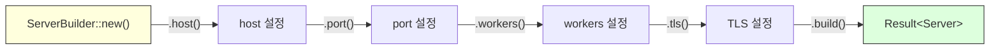

# 빌더, RAII, Newtype 패턴

## 24.1 빌더 패턴 (Builder Pattern)

빌더 패턴은 복잡한 객체를 단계적으로 구성할 때 사용합니다. Rust에서는 소유권을 활용한 체이닝 방식이 일반적입니다.



```rust,editable
#[derive(Debug)]
struct Server {
    host: String,
    port: u16,
    workers: usize,
    tls: bool,
    max_connections: u32,
    log_level: String,
}

#[derive(Debug)]
struct ServerBuilder {
    host: String,
    port: Option<u16>,
    workers: Option<usize>,
    tls: bool,
    max_connections: u32,
    log_level: String,
}

impl ServerBuilder {
    fn new(host: &str) -> Self {
        ServerBuilder {
            host: host.to_string(),
            port: None,
            workers: None,
            tls: false,
            max_connections: 1000,
            log_level: "info".to_string(),
        }
    }

    fn port(mut self, port: u16) -> Self {
        self.port = Some(port);
        self
    }

    fn workers(mut self, n: usize) -> Self {
        self.workers = Some(n);
        self
    }

    fn tls(mut self, enabled: bool) -> Self {
        self.tls = enabled;
        self
    }

    fn max_connections(mut self, n: u32) -> Self {
        self.max_connections = n;
        self
    }

    fn log_level(mut self, level: &str) -> Self {
        self.log_level = level.to_string();
        self
    }

    fn build(self) -> Result<Server, String> {
        let port = self.port.ok_or("포트가 설정되지 않았습니다")?;
        let workers = self.workers.unwrap_or_else(num_cpus);

        if port == 0 {
            return Err("포트는 0이 될 수 없습니다".to_string());
        }

        Ok(Server {
            host: self.host,
            port,
            workers,
            tls: self.tls,
            max_connections: self.max_connections,
            log_level: self.log_level,
        })
    }
}

fn num_cpus() -> usize { 4 } // 시뮬레이션

fn main() {
    // 체이닝으로 간결하게 구성
    let server = ServerBuilder::new("0.0.0.0")
        .port(8080)
        .workers(8)
        .tls(true)
        .max_connections(5000)
        .log_level("debug")
        .build()
        .expect("서버 생성 실패");

    println!("서버 설정: {:#?}", server);

    // 최소 설정
    let minimal = ServerBuilder::new("localhost")
        .port(3000)
        .build()
        .expect("서버 생성 실패");

    println!("\n최소 서버: {:#?}", minimal);

    // 유효성 검사 실패
    let err = ServerBuilder::new("localhost")
        .build();
    println!("\n에러: {:?}", err);
}
```

<div class="tip-box">
<strong>💡 빌더 패턴 변형</strong><br>
<ul>
<li><strong>소유권 이동 빌더</strong> (위 예제): <code>self</code>를 소비하여 체이닝. 각 호출 후 빌더 재사용 불가.</li>
<li><strong>가변 참조 빌더</strong>: <code>&mut self</code>를 사용하여 빌더 재사용 가능. 마지막에 <code>.build()</code>에서 클론.</li>
<li><strong>Typestate 빌더</strong>: 필수 필드를 타입 수준에서 보장 (21장 참조).</li>
</ul>
</div>

---

## 24.2 RAII 패턴

RAII(Resource Acquisition Is Initialization)는 자원 획득을 초기화와 결합하고, `Drop` 트레이트로 자동 해제를 보장합니다.

```rust,editable
use std::time::Instant;

// 타이머: 스코프 동안 경과 시간 측정
struct Timer {
    label: String,
    start: Instant,
}

impl Timer {
    fn new(label: &str) -> Self {
        println!("[{}] 시작", label);
        Timer {
            label: label.to_string(),
            start: Instant::now(),
        }
    }
}

impl Drop for Timer {
    fn drop(&mut self) {
        let elapsed = self.start.elapsed();
        println!("[{}] 완료: {:?}", self.label, elapsed);
    }
}

// 잠금: 스코프 동안 잠금 유지
struct SimpleLock {
    name: String,
}

impl SimpleLock {
    fn acquire(name: &str) -> Self {
        println!("잠금 획득: {}", name);
        SimpleLock { name: name.to_string() }
    }
}

impl Drop for SimpleLock {
    fn drop(&mut self) {
        println!("잠금 해제: {}", self.name);
    }
}

// 임시 파일: 스코프 종료 시 삭제
struct TempFile {
    path: String,
}

impl TempFile {
    fn create(path: &str) -> Self {
        println!("임시 파일 생성: {}", path);
        TempFile { path: path.to_string() }
    }

    fn write(&self, content: &str) {
        println!("파일 쓰기: {} <- \"{}\"", self.path, content);
    }
}

impl Drop for TempFile {
    fn drop(&mut self) {
        println!("임시 파일 삭제: {}", self.path);
    }
}

fn process_data() {
    let _timer = Timer::new("데이터 처리");
    let _lock = SimpleLock::acquire("data_mutex");
    let temp = TempFile::create("/tmp/processing.tmp");

    temp.write("중간 결과 데이터");

    // 시뮬레이션: 무거운 작업
    let sum: u64 = (0..1_000_000).sum();
    println!("계산 결과: {}", sum);

    // 함수 종료 시 역순으로 드롭:
    // 1. temp (임시 파일 삭제)
    // 2. _lock (잠금 해제)
    // 3. _timer (경과 시간 출력)
}

fn main() {
    process_data();
    println!("\n모든 자원이 자동으로 해제되었습니다.");
}
```

---

## 24.3 Newtype 패턴 활용

Newtype 패턴으로 도메인별 타입 안전성을 확보합니다.

```rust,editable
use std::fmt;

// 도메인 타입 정의
#[derive(Debug, Clone, PartialEq)]
struct Email(String);

#[derive(Debug, Clone, PartialEq)]
struct Username(String);

#[derive(Debug, Clone, PartialEq)]
struct Password(String);

impl Email {
    fn new(value: &str) -> Result<Self, String> {
        if value.contains('@') && value.contains('.') {
            Ok(Email(value.to_lowercase()))
        } else {
            Err(format!("잘못된 이메일: {}", value))
        }
    }
}

impl Username {
    fn new(value: &str) -> Result<Self, String> {
        if value.len() >= 3 && value.len() <= 20 && value.chars().all(|c| c.is_alphanumeric() || c == '_') {
            Ok(Username(value.to_string()))
        } else {
            Err(format!("잘못된 사용자명: {} (3~20자, 영숫자와 _만 허용)", value))
        }
    }
}

impl Password {
    fn new(value: &str) -> Result<Self, String> {
        if value.len() < 8 {
            return Err("비밀번호는 8자 이상이어야 합니다".to_string());
        }
        Ok(Password(value.to_string()))
    }
}

// Password는 Display에서 값을 숨김
impl fmt::Display for Password {
    fn fmt(&self, f: &mut fmt::Formatter<'_>) -> fmt::Result {
        write!(f, "********")
    }
}

impl fmt::Display for Email {
    fn fmt(&self, f: &mut fmt::Formatter<'_>) -> fmt::Result {
        write!(f, "{}", self.0)
    }
}

impl fmt::Display for Username {
    fn fmt(&self, f: &mut fmt::Formatter<'_>) -> fmt::Result {
        write!(f, "{}", self.0)
    }
}

// 타입 안전한 함수 - 인수 순서 혼동 방지
fn register(username: Username, email: Email, password: Password) {
    println!("등록: {} ({}) [비밀번호: {}]", username, email, password);
}

fn main() {
    let username = Username::new("rust_user").unwrap();
    let email = Email::new("user@Example.COM").unwrap();
    let password = Password::new("secure_password_123").unwrap();

    register(username, email, password);

    // 잘못된 순서로 호출하면 컴파일 에러!
    // register(email, username, password); // 타입 불일치

    // 유효성 검사 실패 예시
    println!("\n유효성 검사:");
    println!("  {:?}", Email::new("invalid"));
    println!("  {:?}", Username::new("ab"));
    println!("  {:?}", Password::new("short"));
}
```
