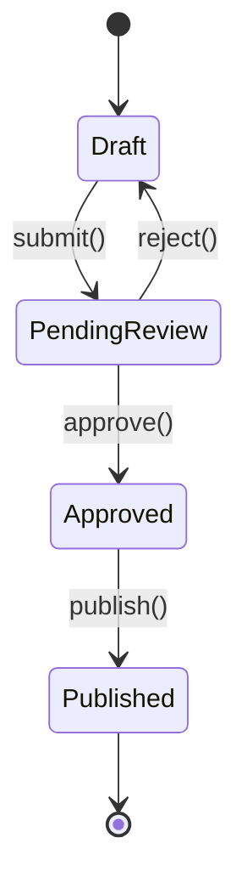

# 상태, 전략, 이터레이터 패턴

## 24.4 상태 패턴 (State Pattern with Enums)

열거형을 사용한 상태 패턴은 Rust에서 가장 자연스러운 패턴 중 하나입니다.



```rust,editable
use std::time::SystemTime;

#[derive(Debug)]
enum PostState {
    Draft {
        content: String,
        last_edited: SystemTime,
    },
    PendingReview {
        content: String,
        submitted_at: SystemTime,
    },
    Approved {
        content: String,
        approved_by: String,
    },
    Published {
        content: String,
        published_at: SystemTime,
        url: String,
    },
}

impl PostState {
    fn new(content: &str) -> Self {
        PostState::Draft {
            content: content.to_string(),
            last_edited: SystemTime::now(),
        }
    }

    fn submit(self) -> Self {
        match self {
            PostState::Draft { content, .. } => {
                println!("리뷰 요청됨");
                PostState::PendingReview {
                    content,
                    submitted_at: SystemTime::now(),
                }
            }
            other => {
                println!("Draft 상태에서만 제출할 수 있습니다.");
                other
            }
        }
    }

    fn approve(self, reviewer: &str) -> Self {
        match self {
            PostState::PendingReview { content, .. } => {
                println!("{}이(가) 승인함", reviewer);
                PostState::Approved {
                    content,
                    approved_by: reviewer.to_string(),
                }
            }
            other => {
                println!("PendingReview 상태에서만 승인할 수 있습니다.");
                other
            }
        }
    }

    fn reject(self, reason: &str) -> Self {
        match self {
            PostState::PendingReview { content, .. } => {
                println!("반려됨: {}", reason);
                PostState::Draft {
                    content,
                    last_edited: SystemTime::now(),
                }
            }
            other => {
                println!("PendingReview 상태에서만 반려할 수 있습니다.");
                other
            }
        }
    }

    fn publish(self) -> Self {
        match self {
            PostState::Approved { content, .. } => {
                let url = format!("/posts/{}", content.len()); // 간단한 URL 생성
                println!("발행됨: {}", url);
                PostState::Published {
                    content,
                    published_at: SystemTime::now(),
                    url,
                }
            }
            other => {
                println!("Approved 상태에서만 발행할 수 있습니다.");
                other
            }
        }
    }

    fn content(&self) -> &str {
        match self {
            PostState::Draft { content, .. }
            | PostState::PendingReview { content, .. }
            | PostState::Approved { content, .. }
            | PostState::Published { content, .. } => content,
        }
    }

    fn state_name(&self) -> &str {
        match self {
            PostState::Draft { .. } => "초안",
            PostState::PendingReview { .. } => "리뷰 대기",
            PostState::Approved { .. } => "승인됨",
            PostState::Published { .. } => "발행됨",
        }
    }
}

fn main() {
    let post = PostState::new("Rust 디자인 패턴 가이드");
    println!("상태: {} - 내용: {}", post.state_name(), post.content());

    let post = post.submit();
    println!("상태: {}", post.state_name());

    // 반려 후 다시 제출
    let post = post.reject("오탈자 수정 필요");
    println!("상태: {}", post.state_name());

    let post = post.submit();
    let post = post.approve("편집장");
    println!("상태: {}", post.state_name());

    let post = post.publish();
    println!("상태: {}", post.state_name());
}
```

---

## 24.5 전략 패턴 (Strategy Pattern)

트레이트 객체 또는 클로저로 런타임에 알고리즘을 교체합니다.

```rust,editable
// 트레이트 객체 방식
trait SortStrategy {
    fn sort(&self, data: &mut Vec<i32>);
    fn name(&self) -> &str;
}

struct BubbleSort;
struct QuickSort;
struct InsertionSort;

impl SortStrategy for BubbleSort {
    fn sort(&self, data: &mut Vec<i32>) {
        let n = data.len();
        for i in 0..n {
            for j in 0..n - 1 - i {
                if data[j] > data[j + 1] {
                    data.swap(j, j + 1);
                }
            }
        }
    }
    fn name(&self) -> &str { "버블 정렬" }
}

impl SortStrategy for QuickSort {
    fn sort(&self, data: &mut Vec<i32>) {
        data.sort(); // 표준 라이브러리 사용 (실제로는 Tim sort)
    }
    fn name(&self) -> &str { "퀵 정렬" }
}

impl SortStrategy for InsertionSort {
    fn sort(&self, data: &mut Vec<i32>) {
        for i in 1..data.len() {
            let key = data[i];
            let mut j = i;
            while j > 0 && data[j - 1] > key {
                data[j] = data[j - 1];
                j -= 1;
            }
            data[j] = key;
        }
    }
    fn name(&self) -> &str { "삽입 정렬" }
}

// 전략을 사용하는 컨텍스트
struct Sorter {
    strategy: Box<dyn SortStrategy>,
}

impl Sorter {
    fn new(strategy: Box<dyn SortStrategy>) -> Self {
        Sorter { strategy }
    }

    fn sort(&self, data: &mut Vec<i32>) {
        println!("정렬 알고리즘: {}", self.strategy.name());
        self.strategy.sort(data);
    }

    // 전략 교체
    fn set_strategy(&mut self, strategy: Box<dyn SortStrategy>) {
        self.strategy = strategy;
    }
}

// 클로저 방식 (더 간결)
fn sort_with<F: Fn(&mut Vec<i32>)>(data: &mut Vec<i32>, strategy: F) {
    strategy(data);
}

fn main() {
    let mut data = vec![64, 34, 25, 12, 22, 11, 90];

    // 트레이트 객체 방식
    let mut sorter = Sorter::new(Box::new(BubbleSort));
    let mut d1 = data.clone();
    sorter.sort(&mut d1);
    println!("결과: {:?}\n", d1);

    // 전략 교체
    sorter.set_strategy(Box::new(InsertionSort));
    let mut d2 = data.clone();
    sorter.sort(&mut d2);
    println!("결과: {:?}\n", d2);

    // 클로저 방식
    let mut d3 = data.clone();
    sort_with(&mut d3, |v| v.sort());
    println!("클로저 정렬: {:?}", d3);

    let mut d4 = data.clone();
    sort_with(&mut d4, |v| v.sort_by(|a, b| b.cmp(a)));
    println!("역순 정렬: {:?}", d4);
}
```

---

## 24.6 이터레이터 체이닝 패턴

Rust의 이터레이터는 지연 평가(lazy evaluation)와 제로 비용 추상화를 제공합니다.

```rust,editable
fn main() {
    let data = vec![
        ("Alice", 85), ("Bob", 92), ("Charlie", 78),
        ("Diana", 96), ("Eve", 88), ("Frank", 71),
        ("Grace", 94), ("Hank", 65), ("Ivy", 90),
    ];

    // 체이닝: 80점 이상 학생의 이름을 점수 순으로 정렬
    let honor_roll: Vec<&str> = data.iter()
        .filter(|(_, score)| *score >= 80)
        .map(|(name, _)| *name)
        .collect::<Vec<_>>()
        .into_iter()
        .collect();
    println!("우등생: {:?}", honor_roll);

    // 통계 계산
    let scores: Vec<i32> = data.iter().map(|(_, s)| *s).collect();
    let count = scores.len();
    let sum: i32 = scores.iter().sum();
    let avg = sum as f64 / count as f64;
    let max = scores.iter().max().unwrap();
    let min = scores.iter().min().unwrap();

    println!("\n통계:");
    println!("  인원: {}, 평균: {:.1}, 최고: {}, 최저: {}", count, avg, max, min);

    // 그룹핑 패턴
    let (passed, failed): (Vec<_>, Vec<_>) = data.iter()
        .partition(|(_, score)| *score >= 70);
    println!("\n합격: {} 명, 불합격: {} 명", passed.len(), failed.len());

    // fold로 복잡한 집계
    let report = data.iter()
        .fold(String::new(), |mut acc, (name, score)| {
            let grade = match score {
                90..=100 => "A",
                80..=89 => "B",
                70..=79 => "C",
                _ => "F",
            };
            acc.push_str(&format!("  {} - {} ({})\n", name, score, grade));
            acc
        });
    println!("성적표:\n{}", report);

    // enumerate + windows 패턴 (슬라이스에서)
    let numbers = vec![1, 3, 2, 5, 4, 8, 7, 6];
    let increasing_pairs: Vec<_> = numbers.windows(2)
        .enumerate()
        .filter(|(_, w)| w[1] > w[0])
        .map(|(i, w)| (i, w[0], w[1]))
        .collect();
    println!("증가 쌍: {:?}", increasing_pairs);
}
```
