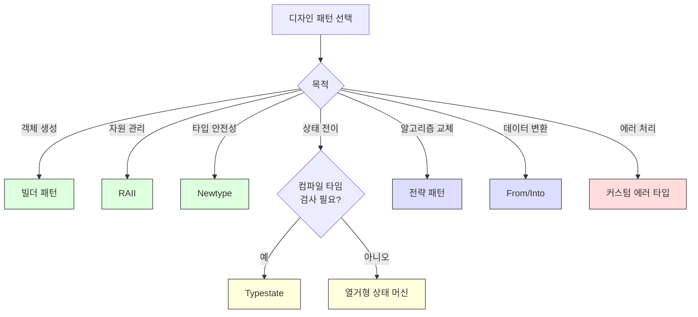

# 에러 처리와 변환 패턴

## 24.7 에러 처리 패턴

```rust,editable
use std::fmt;
use std::num::ParseIntError;

// 커스텀 에러 타입
#[derive(Debug)]
enum AppError {
    NotFound(String),
    ParseError(ParseIntError),
    ValidationError { field: String, message: String },
    Internal(String),
}

impl fmt::Display for AppError {
    fn fmt(&self, f: &mut fmt::Formatter<'_>) -> fmt::Result {
        match self {
            AppError::NotFound(item) => write!(f, "찾을 수 없음: {}", item),
            AppError::ParseError(e) => write!(f, "파싱 에러: {}", e),
            AppError::ValidationError { field, message } =>
                write!(f, "유효성 검사 실패 [{}]: {}", field, message),
            AppError::Internal(msg) => write!(f, "내부 에러: {}", msg),
        }
    }
}

impl std::error::Error for AppError {
    fn source(&self) -> Option<&(dyn std::error::Error + 'static)> {
        match self {
            AppError::ParseError(e) => Some(e),
            _ => None,
        }
    }
}

// From 구현으로 ? 연산자 사용
impl From<ParseIntError> for AppError {
    fn from(e: ParseIntError) -> Self {
        AppError::ParseError(e)
    }
}

// 도메인별 Result 별칭
type AppResult<T> = Result<T, AppError>;

fn parse_age(input: &str) -> AppResult<u32> {
    let age: u32 = input.parse()?; // ParseIntError -> AppError 자동 변환

    if age > 150 {
        return Err(AppError::ValidationError {
            field: "age".to_string(),
            message: "나이는 150 이하여야 합니다".to_string(),
        });
    }

    Ok(age)
}

fn find_user(name: &str) -> AppResult<String> {
    let users = vec!["Alice", "Bob", "Charlie"];
    users.iter()
        .find(|&&u| u == name)
        .map(|u| u.to_string())
        .ok_or_else(|| AppError::NotFound(name.to_string()))
}

fn process_request(name: &str, age_str: &str) -> AppResult<String> {
    let user = find_user(name)?;
    let age = parse_age(age_str)?;
    Ok(format!("{} ({}세)", user, age))
}

fn main() {
    // 성공 사례
    match process_request("Alice", "30") {
        Ok(result) => println!("성공: {}", result),
        Err(e) => println!("에러: {}", e),
    }

    // 다양한 에러
    let cases = vec![
        ("Unknown", "25"),
        ("Bob", "abc"),
        ("Charlie", "200"),
    ];

    for (name, age) in cases {
        match process_request(name, age) {
            Ok(result) => println!("성공: {}", result),
            Err(e) => println!("에러: {}", e),
        }
    }
}
```

---

## 24.8 From/Into로 유연한 API 설계

```rust,editable
#[derive(Debug)]
struct Color {
    r: u8,
    g: u8,
    b: u8,
    a: u8,
}

// 다양한 입력 형식에서 Color로 변환
impl From<(u8, u8, u8)> for Color {
    fn from((r, g, b): (u8, u8, u8)) -> Self {
        Color { r, g, b, a: 255 }
    }
}

impl From<(u8, u8, u8, u8)> for Color {
    fn from((r, g, b, a): (u8, u8, u8, u8)) -> Self {
        Color { r, g, b, a }
    }
}

impl From<u32> for Color {
    fn from(hex: u32) -> Self {
        Color {
            r: ((hex >> 16) & 0xFF) as u8,
            g: ((hex >> 8) & 0xFF) as u8,
            b: (hex & 0xFF) as u8,
            a: 255,
        }
    }
}

impl From<&str> for Color {
    fn from(s: &str) -> Self {
        match s.to_lowercase().as_str() {
            "red" => Color { r: 255, g: 0, b: 0, a: 255 },
            "green" => Color { r: 0, g: 255, b: 0, a: 255 },
            "blue" => Color { r: 0, g: 0, b: 255, a: 255 },
            _ => Color { r: 0, g: 0, b: 0, a: 255 },
        }
    }
}

// Into를 활용한 유연한 함수 인터페이스
fn set_background(color: impl Into<Color>) {
    let c: Color = color.into();
    println!("배경색: rgba({}, {}, {}, {})", c.r, c.g, c.b, c.a);
}

fn main() {
    // 다양한 형식으로 호출 가능
    set_background((255u8, 128u8, 0u8));          // RGB 튜플
    set_background((100u8, 200u8, 50u8, 128u8));  // RGBA 튜플
    set_background(0xFF6600u32);                   // 16진수
    set_background("blue");                        // 이름

    // 직접 변환
    let color: Color = "red".into();
    println!("\n직접 변환: {:?}", color);
}
```

---

## 패턴 비교



---

<div class="exercise-box">

### 연습문제

**연습 1**: 빌더 패턴으로 `Email` 메시지를 구성하세요. 필수: `to`, `subject`. 선택: `cc`, `bcc`, `body`, `attachments`.

```rust,editable
struct Email {
    to: String,
    subject: String,
    cc: Vec<String>,
    bcc: Vec<String>,
    body: String,
    attachments: Vec<String>,
}

struct EmailBuilder {
    // 필드를 정의하세요
}

impl EmailBuilder {
    fn new(to: &str, subject: &str) -> Self {
        todo!()
    }

    // 체이닝 메서드를 구현하세요

    fn build(self) -> Email {
        todo!()
    }
}

fn main() {
    // let email = EmailBuilder::new("user@example.com", "안녕하세요")
    //     .body("Rust 공부 중입니다.")
    //     .cc("manager@example.com")
    //     .build();
    println!("이메일 빌더를 구현하세요!");
}
```

**연습 2**: 전략 패턴으로 텍스트 포맷터를 구현하세요. 전략: UpperCase, LowerCase, TitleCase, CamelCase.

```rust,editable
trait TextFormatter {
    fn format(&self, input: &str) -> String;
}

// 각 전략을 구현하세요

fn main() {
    let text = "hello world from rust";
    // 다양한 포맷터를 적용해 보세요
    println!("텍스트 포맷터를 구현하세요!");
}
```

</div>

---

<div class="quiz-box" onclick="this.classList.toggle('show-answer')">

### 퀴즈 1
빌더 패턴에서 `self`를 소비하는 방식과 `&mut self`를 사용하는 방식의 장단점을 비교하세요.

<div class="quiz-answer">
<strong>self 소비 방식</strong>: 각 메서드가 빌더의 소유권을 가져가고 새 빌더를 반환합니다. 장점은 체이닝이 자연스럽고 빌더 재사용 실수를 방지합니다. 단점은 빌더를 재사용할 수 없습니다.<br>
<strong>&mut self 방식</strong>: 빌더를 가변 참조로 수정합니다. 장점은 빌더를 재사용할 수 있고, 조건부 설정이 쉽습니다. 단점은 <code>build()</code>에서 데이터를 클론해야 할 수 있고, 빌더가 유효하지 않은 상태로 남을 수 있습니다.
</div>
</div>

<div class="quiz-box" onclick="this.classList.toggle('show-answer')">

### 퀴즈 2
Rust에서 전통적인 상속 기반 전략 패턴 대신 어떤 대안이 있나요?

<div class="quiz-answer">
세 가지 대안이 있습니다:<br>
1. <strong>트레이트 객체</strong> (<code>Box&lt;dyn Strategy&gt;</code>): 런타임 다형성. 동적 디스패치 비용이 있지만 유연합니다.<br>
2. <strong>클로저</strong> (<code>Fn</code> 트레이트): 가장 간결. 상태 없는 단순 전략에 적합합니다.<br>
3. <strong>제네릭 + 트레이트 바운드</strong> (<code>T: Strategy</code>): 컴파일 타임 다형성. 런타임 비용이 없지만 유형이 고정됩니다.
</div>
</div>

---

<div class="summary-box">

### 요약

| 패턴 | Rust 구현 방식 | 핵심 이점 |
|------|---------------|-----------|
| **빌더** | 체이닝 메서드 + `build()` | 복잡한 객체 구성, 유효성 검사 |
| **RAII** | `Drop` 트레이트 | 자원 자동 해제 보장 |
| **Newtype** | 튜플 구조체 래핑 | 타입 안전성, 도메인 모델링 |
| **상태 패턴** | 열거형 + `match` | 유효한 상태 전이만 허용 |
| **전략 패턴** | 트레이트 객체 / 클로저 | 런타임 알고리즘 교체 |
| **이터레이터 체이닝** | `.filter().map().collect()` | 선언적 데이터 변환 |
| **에러 처리** | 커스텀 에러 + `From` + `?` | 타입 안전한 에러 전파 |
| **From/Into** | 변환 트레이트 구현 | 유연한 API 인터페이스 |

</div>
