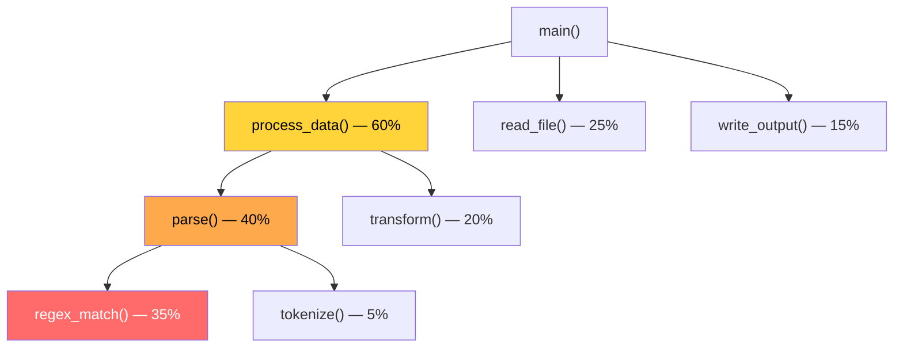

# 제로 비용 추상화와 벤치마킹

## 제로 비용 추상화

> "사용하지 않는 것에 대해 비용을 지불하지 않는다. 사용하는 것에 대해 더 나은 코드를 손으로 작성할 수 없다." — Bjarne Stroustrup (C++), Rust가 채택한 원칙

```rust,editable
fn main() {
    let numbers = vec![1, 2, 3, 4, 5, 6, 7, 8, 9, 10];

    // 반복자 체이닝 — 루프와 동일한 성능으로 컴파일됨
    let sum: i32 = numbers.iter()
        .filter(|&&x| x % 2 == 0)
        .map(|&x| x * x)
        .sum();

    println!("짝수의 제곱 합: {}", sum); // 4 + 16 + 36 + 64 + 100 = 220
}
```

<div class="info-box">
위 반복자 코드는 컴파일러가 아래와 동일한 기계어로 최적화합니다:

```rust,editable
fn main() {
    let numbers = vec![1, 2, 3, 4, 5, 6, 7, 8, 9, 10];
    let mut sum = 0;
    for &x in &numbers {
        if x % 2 == 0 {
            sum += x * x;
        }
    }
    println!("짝수의 제곱 합: {}", sum);
}
```
</div>

## 컴파일러 최적화와 릴리스 빌드

### Debug vs Release

```bash
cargo build          # Debug: 빠른 컴파일, 느린 실행
cargo build --release  # Release: 느린 컴파일, 빠른 실행
```

| 항목 | Debug | Release |
|------|-------|---------|
| 최적화 레벨 | 0 | 3 |
| 컴파일 속도 | 빠름 | 느림 |
| 실행 속도 | 느림 | 빠름 (10~100배) |
| 바이너리 크기 | 큼 | 작음 |
| 디버그 정보 | 포함 | 미포함 |

### Cargo.toml 최적화 설정

```toml
[profile.release]
opt-level = 3       # 최적화 레벨 (0~3, "s", "z")
lto = true           # Link-Time Optimization
codegen-units = 1    # 단일 코드젠 유닛 (느리지만 더 최적화)
panic = "abort"      # 패닉 시 되감기 대신 즉시 종료 (바이너리 크기 감소)
strip = true         # 디버그 심볼 제거
```

<div class="tip-box">
<code>opt-level = "s"</code>는 크기 최적화, <code>"z"</code>는 더 공격적인 크기 최적화입니다. 임베디드 환경에서 유용합니다.
</div>

## 벤치마킹 (`criterion`)

성능 측정 없이 최적화하지 마세요. `criterion`은 Rust의 표준 벤치마킹 크레이트입니다.

### 설정

```toml
# Cargo.toml
[dev-dependencies]
criterion = { version = "0.5", features = ["html_reports"] }

[[bench]]
name = "my_benchmark"
harness = false
```

### 벤치마크 작성

```rust,editable
// benches/my_benchmark.rs 예시 (실제 파일에서 실행)
fn fibonacci_recursive(n: u64) -> u64 {
    match n {
        0 => 0,
        1 => 1,
        n => fibonacci_recursive(n - 1) + fibonacci_recursive(n - 2),
    }
}

fn fibonacci_iterative(n: u64) -> u64 {
    let mut a = 0u64;
    let mut b = 1u64;
    for _ in 0..n {
        let temp = b;
        b = a + b;
        a = temp;
    }
    a
}

fn main() {
    // 간단 비교
    use std::time::Instant;

    let start = Instant::now();
    let result = fibonacci_recursive(30);
    let recursive_time = start.elapsed();

    let start = Instant::now();
    let result2 = fibonacci_iterative(30);
    let iterative_time = start.elapsed();

    println!("재귀: {} ({:?})", result, recursive_time);
    println!("반복: {} ({:?})", result2, iterative_time);
}
```

```bash
cargo bench  # criterion 벤치마크 실행
```

## 프로파일링 도구

### flamegraph

```bash
cargo install flamegraph
cargo flamegraph --release  # SVG 플레임 그래프 생성
```



<div class="tip-box">
플레임 그래프에서 넓은 블록이 가장 시간을 많이 쓰는 함수입니다. 여기를 먼저 최적화하세요.
</div>
