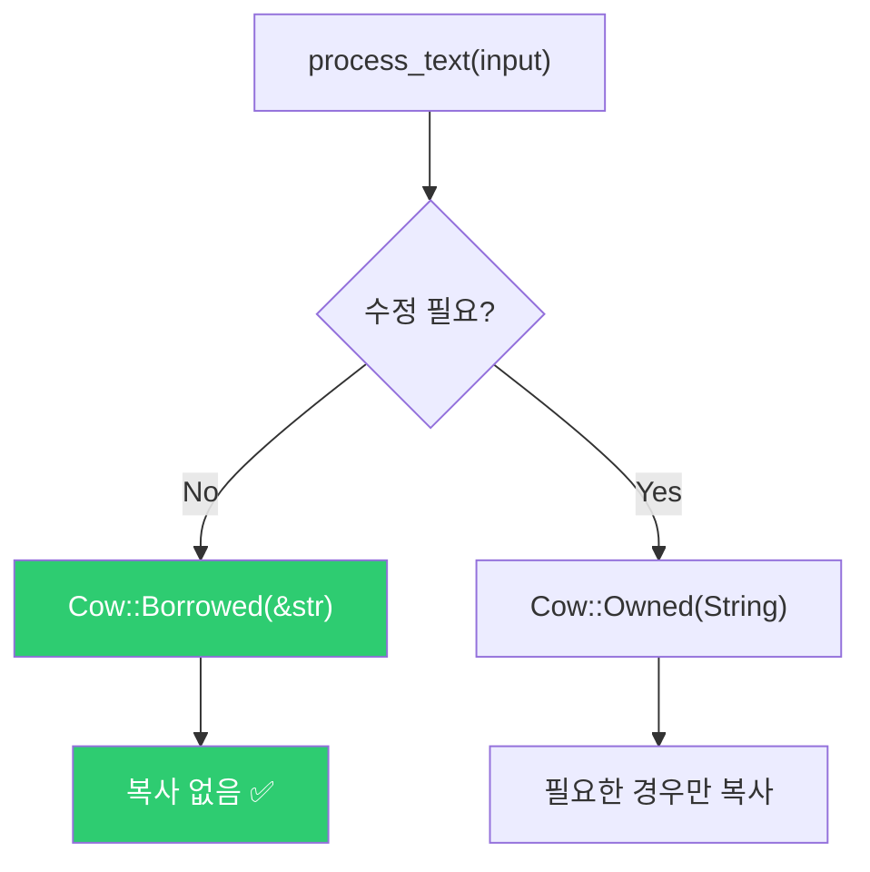

# 메모리 최적화와 성능 팁

## 메모리 사용 최적화

### 구조체 필드 순서

Rust 컴파일러가 패딩을 최적화하지만, `#[repr(C)]`를 쓸 때는 필드 순서가 중요합니다.

```rust,editable
use std::mem;

// 패딩으로 인해 크기가 커질 수 있음
#[repr(C)]
struct Bad {
    a: u8,   // 1바이트 + 7바이트 패딩
    b: u64,  // 8바이트
    c: u8,   // 1바이트 + 7바이트 패딩
}

#[repr(C)]
struct Good {
    b: u64,  // 8바이트
    a: u8,   // 1바이트
    c: u8,   // 1바이트 + 6바이트 패딩
}

fn main() {
    println!("Bad 크기: {} 바이트", mem::size_of::<Bad>());   // 24
    println!("Good 크기: {} 바이트", mem::size_of::<Good>()); // 16

    // Rust 기본 레이아웃은 자동 최적화
    struct Auto {
        a: u8,
        b: u64,
        c: u8,
    }
    println!("Auto 크기: {} 바이트", mem::size_of::<Auto>()); // 16 (자동 재배치)
}
```

### Box로 큰 구조체 힙에 배치

```rust,editable
fn main() {
    // 스택에 큰 배열 → 스택 오버플로우 위험
    // let big = [0u8; 10_000_000];

    // 힙에 배치
    let big = vec![0u8; 10_000_000];
    println!("크기: {} 바이트", big.len());
}
```

## `Cow<T>` — 불필요한 복사 방지

`Cow` (Clone on Write)는 빌림으로 시작하여 수정이 필요할 때만 복제합니다.

```rust,editable
use std::borrow::Cow;

fn process_text(input: &str) -> Cow<str> {
    if input.contains("bad") {
        // 수정이 필요한 경우에만 새 String 생성
        Cow::Owned(input.replace("bad", "good"))
    } else {
        // 수정 불필요 → 복사 없이 참조 반환
        Cow::Borrowed(input)
    }
}

fn main() {
    let text1 = "this is fine";
    let text2 = "this is bad";

    let result1 = process_text(text1);
    let result2 = process_text(text2);

    println!("{}", result1); // 복사 없음
    println!("{}", result2); // "this is good" (복사 발생)

    // Cow는 &str처럼 사용 가능
    println!("길이: {}", result1.len());
}
```



## 일반적인 성능 팁

### 1. 적절한 컬렉션 선택

| 작업 | 최적 컬렉션 |
|------|-------------|
| 순차 접근 | `Vec<T>` |
| 키-값 조회 | `HashMap<K, V>` |
| 정렬된 키 | `BTreeMap<K, V>` |
| 중복 제거 | `HashSet<T>` |
| FIFO 큐 | `VecDeque<T>` |

### 2. 미리 용량 확보

```rust,editable
fn main() {
    // ❌ 느림: 여러 번 재할당
    let mut v1 = Vec::new();
    for i in 0..1000 {
        v1.push(i);
    }

    // ✅ 빠름: 한 번만 할당
    let mut v2 = Vec::with_capacity(1000);
    for i in 0..1000 {
        v2.push(i);
    }

    println!("v1 용량: {}, v2 용량: {}", v1.capacity(), v2.capacity());
}
```

### 3. 문자열 연결

```rust,editable
fn main() {
    let parts = vec!["hello", "world", "rust", "is", "fast"];

    // ❌ 느림: 매번 새 String 생성
    let mut slow = String::new();
    for part in &parts {
        slow = slow + " " + part;
    }

    // ✅ 빠름: 제자리 수정
    let mut fast = String::with_capacity(100);
    for part in &parts {
        if !fast.is_empty() {
            fast.push(' ');
        }
        fast.push_str(part);
    }

    // ✅ 가장 간단: join 사용
    let best = parts.join(" ");

    println!("{}", best);
}
```

### 4. 불필요한 clone() 제거

```rust,editable
fn main() {
    let data = vec![1, 2, 3, 4, 5];

    // ❌ 불필요한 clone
    // let sum: i32 = data.clone().iter().sum();

    // ✅ 참조로 충분
    let sum: i32 = data.iter().sum();
    println!("합: {}", sum);
    println!("데이터: {:?}", data); // 여전히 사용 가능
}
```

## SIMD 기초

SIMD (Single Instruction, Multiple Data)는 하나의 명령으로 여러 데이터를 동시 처리합니다.

```rust,editable
fn main() {
    // 일반적으로는 컴파일러가 자동 벡터화를 수행
    // --release 빌드에서 SIMD 명령을 자동 생성

    let a = [1.0f32; 1000];
    let b = [2.0f32; 1000];
    let mut c = [0.0f32; 1000];

    // 컴파일러가 이 루프를 SIMD로 자동 최적화할 수 있음
    for i in 0..1000 {
        c[i] = a[i] + b[i];
    }

    println!("c[0] = {}, c[999] = {}", c[0], c[999]);
}
```

<div class="info-box">
대부분의 경우 컴파일러의 자동 벡터화로 충분합니다. 수동 SIMD는 <code>std::arch</code> 모듈이나 <code>packed_simd</code> 크레이트를 사용하며, 매우 성능이 중요한 경우에만 필요합니다.
</div>

---

<div class="exercise-box">
<strong>연습문제 1:</strong> 아래 두 함수의 성능 차이를 <code>std::time::Instant</code>로 측정해보세요.

```rust,editable
fn count_with_loop(data: &[i32]) -> usize {
    let mut count = 0;
    for &x in data {
        if x > 50 {
            count += 1;
        }
    }
    count
}

fn count_with_iter(data: &[i32]) -> usize {
    data.iter().filter(|&&x| x > 50).count()
}

fn main() {
    let data: Vec<i32> = (0..1_000_000).collect();

    let start = std::time::Instant::now();
    let c1 = count_with_loop(&data);
    let t1 = start.elapsed();

    let start = std::time::Instant::now();
    let c2 = count_with_iter(&data);
    let t2 = start.elapsed();

    println!("루프: {} ({:?})", c1, t1);
    println!("반복자: {} ({:?})", c2, t2);
}
```
</div>

<div class="exercise-box">
<strong>연습문제 2:</strong> <code>Cow</code>를 사용하여 입력 문자열이 이미 소문자이면 복사하지 않고, 대문자가 포함되어 있을 때만 소문자로 변환하는 함수를 작성하세요.

```rust,editable
use std::borrow::Cow;

fn to_lowercase_cow(input: &str) -> Cow<str> {
    // TODO: 이미 소문자면 Cow::Borrowed, 아니면 Cow::Owned
    todo!()
}

fn main() {
    let a = to_lowercase_cow("already lowercase");
    let b = to_lowercase_cow("Has UPPERCASE");
    println!("{}", a);
    println!("{}", b);
}
```
</div>

---

<div class="quiz-box" onclick="this.classList.toggle('show-answer')">
<strong>Q1:</strong> 제로 비용 추상화란 무엇인가요?
<div class="quiz-answer">
<strong>A:</strong> 추상화를 사용해도 수동으로 최적화한 저수준 코드와 동일한 성능을 보장하는 설계 원칙입니다. Rust의 반복자, 제네릭, 트레이트 등이 대표적인 예입니다. 런타임 비용 없이 컴파일 타임에 모두 해결됩니다.
</div>
</div>

<div class="quiz-box" onclick="this.classList.toggle('show-answer')">
<strong>Q2:</strong> <code>Vec::with_capacity(n)</code>을 사용하면 왜 빨라지나요?
<div class="quiz-answer">
<strong>A:</strong> <code>Vec</code>은 용량이 부족하면 새로운 더 큰 메모리를 할당하고 기존 데이터를 복사합니다. <code>with_capacity</code>로 미리 충분한 크기를 할당하면 이런 재할당과 복사가 발생하지 않습니다.
</div>
</div>

<div class="quiz-box" onclick="this.classList.toggle('show-answer')">
<strong>Q3:</strong> <code>Cow&lt;str&gt;</code>은 언제 사용하면 좋나요?
<div class="quiz-answer">
<strong>A:</strong> 입력 데이터를 대부분의 경우 수정 없이 그대로 사용하고, 일부 경우에만 수정이 필요할 때 적합합니다. 불필요한 <code>String</code> 할당과 복사를 피하면서도 필요할 때는 소유된 데이터를 생성할 수 있습니다.
</div>
</div>

---

<div class="summary-box">
<h3>핵심 정리</h3>

- **제로 비용 추상화**: 반복자, 제네릭 등은 수동 최적화와 동일 성능
- **릴리스 빌드**: `--release` 플래그로 10~100배 성능 향상
- **벤치마킹**: `criterion`으로 정확한 성능 측정 후 최적화
- **프로파일링**: `flamegraph`로 병목 지점 찾기
- **Cow<T>**: 필요한 경우에만 복사하여 불필요한 할당 방지
- **실용 팁**: `with_capacity`, 적절한 컬렉션 선택, 불필요한 `clone()` 제거
- **측정 먼저, 최적화 나중에**: 추측이 아닌 데이터 기반 최적화
</div>
