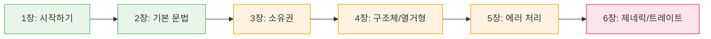
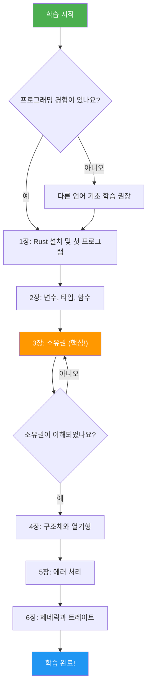

# Rust 프로그래밍 학습 가이드에 오신 것을 환영합니다! 🦀

<span class="badge-beginner">기초</span>

## 환영합니다

이 책은 **Rust 프로그래밍 언어**를 처음부터 체계적으로 배울 수 있도록 구성된 한국어 학습 가이드입니다. Rust는 안전성, 속도, 동시성을 모두 갖춘 현대적인 시스템 프로그래밍 언어로, 전 세계 개발자들 사이에서 빠르게 인기를 얻고 있습니다.

<div class="info-box">

**이 가이드의 특징**: 단순히 문법을 나열하는 것이 아니라, 각 개념이 **왜** 필요한지, **어떤 문제**를 해결하는지를 중심으로 설명합니다. 실습 코드를 직접 수정하고 실행하며 배울 수 있습니다.

</div>

---

## 이 책에서 다루는 내용

이 학습 가이드는 다음과 같은 주제를 단계별로 다룹니다:

| 장 | 주제 | 난이도 |
|---|---|---|
| **1장** | 시작하기 - 설치, Hello World, Cargo | 입문 |
| **2장** | 기본 문법 - 변수, 타입, 함수, 제어 흐름 | 입문 |
| **3장** | 소유권과 빌림 - Rust의 핵심 개념 | 중급 |
| **4장** | 구조체와 열거형 - 사용자 정의 타입 | 중급 |
| **5장** | 패턴 매칭과 에러 처리 | 중급 |
| **6장** | 제네릭, 트레이트, 라이프타임 | 고급 |



---

## 이 책을 사용하는 방법

### 코드 실행

이 책에는 **직접 편집하고 실행할 수 있는 코드 블록**이 포함되어 있습니다. 코드 블록 오른쪽 상단의 **재생 버튼(▶)**을 클릭하면 코드가 실행됩니다.

```rust,editable
fn main() {
    // 아래 메시지를 자유롭게 수정해 보세요!
    let message = "Rust 학습 가이드에 오신 것을 환영합니다!";
    println!("{}", message);

    // 간단한 계산도 해봅시다
    let year = 2026;
    let rust_age = year - 2015; // Rust 1.0 출시: 2015년
    println!("Rust는 {}년 된 언어입니다.", rust_age);
}
```

<div class="tip-box">

**팁**: 코드를 직접 수정해보는 것이 가장 효과적인 학습 방법입니다. 틀려도 괜찮습니다 — 컴파일러가 친절한 오류 메시지로 안내해 줄 것입니다!

</div>

### 학습 진행 추적

아래 대시보드에서 각 장의 학습 진행 상황을 확인할 수 있습니다:

<div id="progress-dashboard"></div>

### 박스 유형 안내

이 책에서는 다양한 스타일의 박스를 사용하여 중요한 정보를 강조합니다:

<div class="info-box">

**정보**: 추가적인 배경 지식이나 참고 사항을 제공합니다.

</div>

<div class="tip-box">

**팁**: 실용적인 조언이나 모범 사례를 알려줍니다.

</div>

<div class="warning-box">

**주의**: 흔히 발생하는 실수나 주의해야 할 사항을 안내합니다.

</div>

<div class="exercise-box">

**연습문제**: 배운 내용을 직접 실습해볼 수 있는 과제입니다.

</div>

<div class="quiz-box" onclick="this.classList.toggle('show-answer')">

**퀴즈**: 클릭하면 정답을 확인할 수 있는 문제입니다.

<div class="quiz-answer">

이렇게 정답이 표시됩니다!

</div>
</div>

---

## 사전 준비 사항 (Prerequisites)

이 책을 학습하기 위해 다음 사항이 필요합니다:

### 필수 사항

- **컴퓨터**: Windows, macOS, 또는 Linux 운영체제
- **기본 프로그래밍 지식**: 변수, 함수, 조건문, 반복문의 개념을 이해하고 있으면 충분합니다
- **터미널/명령 프롬프트 기본 사용법**: `cd`, `ls`(또는 `dir`) 등의 기본 명령어를 사용할 줄 알아야 합니다

### 권장 사항

- **C/C++ 경험**: 필수는 아니지만, 포인터나 메모리 관리 개념을 알고 있으면 Rust의 소유권 시스템을 이해하는 데 도움이 됩니다
- **Git 기본 사용법**: 프로젝트 관리와 버전 관리에 유용합니다
- **영어 독해 능력**: 공식 문서와 에러 메시지는 영어로 제공됩니다

<div class="warning-box">

**프로그래밍을 처음 접하시나요?** 이 책은 최소한 하나의 프로그래밍 언어를 경험해 본 분을 대상으로 합니다. 만약 프로그래밍 자체가 처음이라면, Python과 같은 입문 친화적인 언어를 먼저 학습하는 것을 권장합니다.

</div>

### 개발 환경 설정

다음 장에서 자세히 다루겠지만, 미리 준비하고 싶다면:

1. **Rust 설치**: [rustup.rs](https://rustup.rs)에서 설치
2. **에디터**: [VS Code](https://code.visualstudio.com/) + rust-analyzer 확장 프로그램
3. **브라우저**: 이 책의 인터랙티브 코드를 실행하기 위한 최신 웹 브라우저

---

## 학습 로드맵



<div class="summary-box">

**요약**
- 이 책은 Rust를 한국어로 체계적으로 학습하기 위한 가이드입니다
- 코드를 직접 편집하고 실행하면서 배울 수 있습니다
- 기본적인 프로그래밍 지식이 있으면 시작할 수 있습니다
- 1장부터 순서대로 학습하는 것을 권장합니다

</div>

---

> 준비가 되셨나요? [1장: 시작하기](ch01/ch01-00-getting-started.md)로 이동하여 Rust 여행을 시작합시다!
